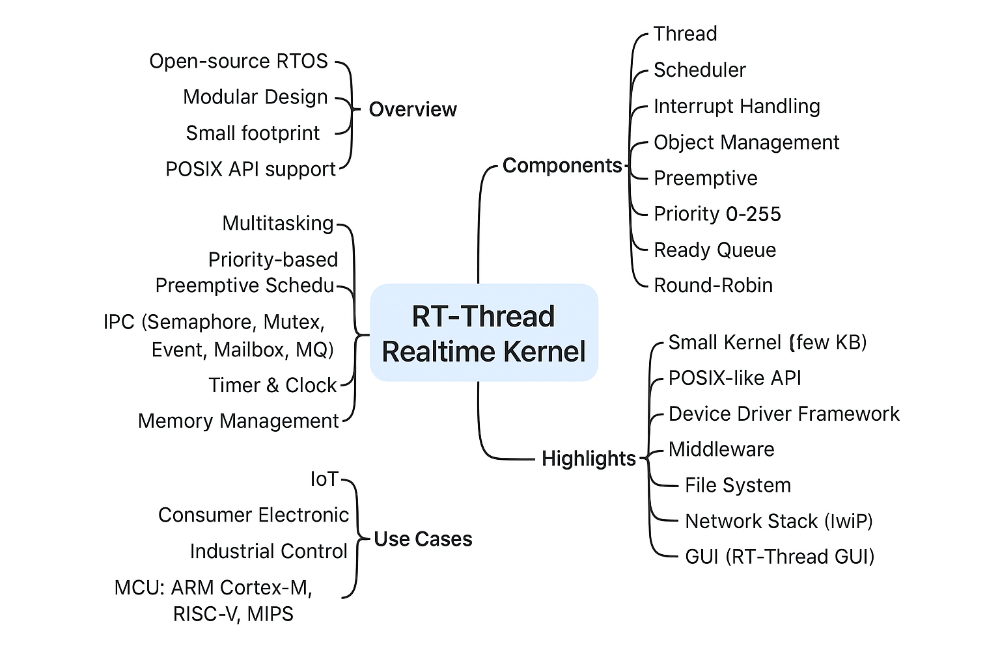

# RT-Thread Realtime Kernel

RT-Thread เริ่มพัฒนาในปี 2006 เป็นระบบปฏิบัติการเรียลไทม์ (RTOS) แบบโอเพ่นซอร์ส ที่เป็นกลางและขับเคลื่อนโดยชุมชนผู้พัฒนา RT-Thread พัฒนาโดยใช้ภาษา C เป็นหลัก ทำให้เข้าใจง่ายและพกพาไปยังไมโครคอนโทรลเลอร์ (MCU) หลากหลายรุ่นได้รวดเร็ว อีกทั้งยังประยุกต์แนวคิดการเขียนโปรแกรมเชิงวัตถุ (OOP) มาช่วยออกแบบ ทำให้โค้ดมีโครงสร้างที่ชัดเจน ยืดหยุ่น และปรับแต่งได้ง่าย 

## RT-Thread มี 2 เวอร์ชัน คือ Standard และ Nano

Nano Version: เหมาะสำหรับ MCU ที่ทรัพยากรจำกัด ใช้ Flash เพียง ~3KB และ RAM 1.2KB และยังมีเครื่องมือที่ช่วยปรับแต่งได้ง่าย

Standard Version: เหมาะกับอุปกรณ์ IoT ที่มีทรัพยากรเพียงพอ สามารถใช้เครื่องมือจัดการแพ็กเกจออนไลน์และระบบคอนฟิก เพื่อนำเข้าโมดูลหรือซอฟต์แวร์เสริมได้อย่างรวดเร็ว รองรับฟีเจอร์ซับซ้อน เช่น อินเทอร์เฟซกราฟิกแบบ Android การเลื่อนหน้าจอสัมผัส หรือการโต้ตอบด้วยเสียงอัจฉริยะ

## RT-Thread Architecture
RT-Thread ไม่ได้มีเพียงแค่เคอร์เนลเรียลไทม์เท่านั้น แต่ยังมาพร้อมกับคอมโพเนนต์เสริมมากมาย โครงสร้างสถาปัตยกรรมของ RT-Thread มีดังนี้:

## 1. Hardware Realtime Kernel
Kernel Layer คือหัวใจหลักของ RT-Thread ประกอบด้วยการทำงานสำคัญ เช่น
- การทำงานแบบมัลติเธรดและตัวจัดการตารางเวลา (Scheduler)
- การสื่อสารระหว่างเธรด เช่น Semaphore, Mailbox, Message Queue
- การจัดการหน่วยความจำ
- Timer

นอกจากนี้ยังมี libcpu/BSP (Board Support Package) ซึ่งเกี่ยวข้องโดยตรงกับฮาร์ดแวร์ ทำหน้าที่เป็นไดรเวอร์อุปกรณ์ต่อพ่วงและการพอร์ตซีพียูให้รองรับ RT-Thread

## 2. Component
Components and Service Layer คือชั้นซอฟต์แวร์ที่อยู่บนเคอร์เนล RT-Thread เช่น
- Virtual File System (VFS)
- FinSH (Command-line Interface)
- Network Framework
- Device Framework

## 3. RT-Thread Software Package
RT-Thread Software Package คือชุดซอฟต์แวร์เสริมที่รันบน RT-Thread เพื่อรองรับงานหลากหลาย ประกอบด้วยไฟล์อธิบาย ข้อมูลซอร์สโค้ด หรือไฟล์ไลบรารี RT-Thread มีแพลตฟอร์มแพ็กเกจแบบเปิด ที่นักพัฒนาสามารถเลือกใช้ได้ทั้งจากทีมพัฒนาอย่างเป็นทางการหรือจากชุมชน

ระบบ ecosystem ของแพ็กเกจ ถือว่าสำคัญมาก เพราะมีคุณสมบัติ ใช้ซ้ำได้สูงและเป็นโมดูลาร์ ทำให้นักพัฒนาสามารถสร้างระบบที่ต้องการได้รวดเร็ว ปัจจุบัน RT-Thread รองรับแพ็กเกจกว่า 370 รายการ 

# RT-Thread Realtime Kernel (Mindmap)

by: chatgpt