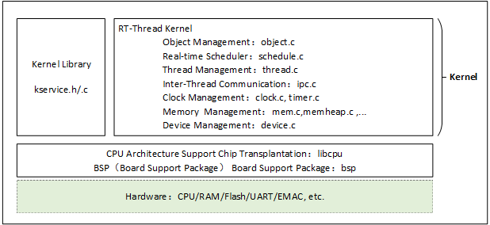

# พื้นฐาน การทำงานของ Kernel

การแนะนำเคอร์เนล กระบวนการเริ่มต้นของระบบ และการตั้งค่าบางส่วนของเคอร์เนล เพื่อเป็นรากฐานให้เข้าใจเนื้อหาในบทต่อ ๆ ไป

ในส่วนนี้จะเป็นการเกริ่นนำเกี่ยวกับโครงสร้างซอฟต์แวร์ของ RT-Thread Kernel เพื่ออธิบายองค์ประกอบและการทำงานของเคอร์เนลเรียลไทม์ พร้อมทั้งแนวคิดพื้นฐานที่ผู้เริ่มต้นควรรู้ หลังจากเรียนจบบทนี้ ผู้อ่านจะเข้าใจว่า

- เคอร์เนลประกอบด้วยอะไรบ้าง
- ระบบเริ่มทำงานอย่างไร
- หน่วยความจำถูกจัดสรรอย่างไร
- และวิธีการตั้งค่าเคอร์เนล

เคอร์เนล เป็นส่วนที่สำคัญที่สุดและพื้นฐานที่สุดของระบบปฏิบัติการ ใน RT-Thread เคอร์เนลทำงานอยู่เหนือชั้นฮาร์ดแวร์ ภายในประกอบด้วย 2 ส่วนหลัก คือ
- Kernel Library (ไลบรารีของเคอร์เนล)
- Real-Time Kernel Implementation (การทำงานของเคอร์เนลเรียลไทม์)

Kernel Library คือชุดฟังก์ชันย่อยที่คล้ายกับ C Library ซึ่งถูกทำขึ้นมาเพื่อให้เคอร์เนลสามารถทำงานได้อย่างอิสระ โดยฟังก์ชันที่รวมอยู่จะแตกต่างกันไปตาม Compiler ที่ใช้ เช่น ถ้าใช้ GNU GCC จะมีฟังก์ชันจาก C Library ที่รองรับมากกว่า Compiler อื่น

C Library หรือ C Runtime Library มีฟังก์ชันมาตรฐาน เช่น strcpy, memcpy, รวมถึงบาง Compiler ที่รองรับ printf และ scanf ด้วย ส่วน RT-Thread Kernel Service Library จะมีเพียงบางส่วนของ C Library ที่จำเป็นเท่านั้น และเพื่อไม่ให้ชื่อซ้ำกับ C Library มาตรฐาน ฟังก์ชันเหล่านี้จะมี Prefix rt_ นำหน้า

การทำงานของ Real-Time Kernel ประกอบด้วย

- การจัดการ Object Object Management object.c
- การจัดการ Real-time Scheduler schedule.c
- การจัดการ Thread Management  thread.c
- การสื่อสาร Inter-Thread Communication  ipc.c
- การจัดการ Clock clock.c, timer.c
- การจัดการหน่วยความจำ Memory Management mem.c, memheap.c
- Device Management device.c

ซึ่งใช้ทรัพยากรน้อยมาก โดยขั้นต่ำคือ 3KB ROM และ 1.2KB RAM