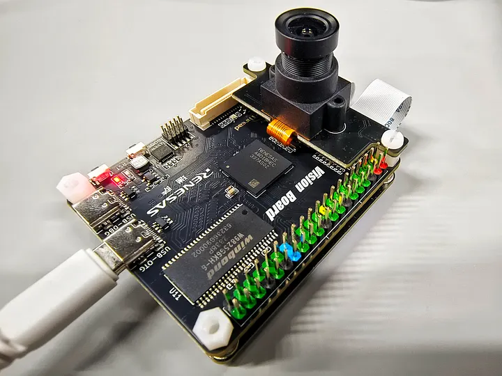
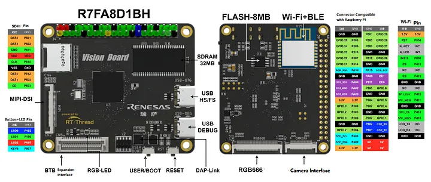

#ARM Cortex-M85 RA8 Vision Board

RT-Thread ร่วมมือกับ Renesas Electronics เผยโฉมนวัตกรรมฮาร์ดแวร์ล่าสุดในชื่อ Vision Board

บอร์ด Vision Board ชูจุดเด่นด้วยการเป็นบอร์ดแรกของโลกที่ใช้ชิป Arm Cortex-M85 ความเร็ว 480 MHz พร้อมเสริมความแข็งแกร่งด้วยเทคโนโลยีล้ำสมัยอย่าง Helium และ TrustZone

ชุดพัฒนาซอฟต์แวร์ (SDK) ที่มาพร้อมกับบอร์ด ได้รวบรวมชุดคำสั่งสำหรับงาน Machine Vision ของ OpenMV และตัวแปลภาษา MicroPython ไว้อย่างลงตัว ซึ่งช่วยให้การพัฒนาแอปพลิเคชันด้าน Machine Vision เป็นไปอย่างง่ายดาย ยิ่งไปกว่านั้น ด้วยการรองรับอุปกรณ์ต่อพ่วง (peripheral) ที่ครอบคลุม และการพัฒนาปรับปรุงอย่างต่อเนื่องจากคลัง SDK ที่ขับเคลื่อนโดยชุมชนนักพัฒนา Vision Board

แน่นอนครับ นี่คือการปรับภาษาให้มีความเป็นวิชาการและเป็นทางการมากขึ้น

เหตุผลในการเลือกใช้ Vision Board สำหรับการประยุกต์ใช้งาน Machine Vision
Vision Board เป็นแพลตฟอร์มฮาร์ดแวร์ที่ได้รับการออกแบบมาโดยมีวัตถุประสงค์เพื่อการพัฒนาระบบ Machine Vision บนไมโครคอนโทรลเลอร์โดยเฉพาะ ปัจจัยหลักเชิงเทคนิคที่สนับสนุนการเลือกใช้บอร์ดดังกล่าวสำหรับการใช้งานประเภทนี้ มีดังต่อไปนี้:

1. ประสิทธิภาพการประมวลผลระดับสูง (High-Level Processing Performance)
บอร์ดมาพร้อมกับหน่วยประมวลผลกลาง (CPU) Arm® Cortex®-M85 ซึ่งมีความเร็วสัญญาณนาฬิกาสูงสุดที่ 480 MHz สมรรถนะดังกล่าวมีความสำคัญอย่างยิ่งต่อการประมวลผลอัลกอริทึม Machine Vision ที่มีความซับซ้อนเชิงคำนวณ (computationally complex) และต้องการการตอบสนองแบบเรียลไทม์

2. การเร่งความเร็วการประมวลผลด้วยฮาร์ดแวร์ (Hardware-Accelerated Processing)
ชิปประมวลผลได้ผนวกเทคโนโลยี Arm® Helium™ หรือ M-Profile Vector Extension (MVE) ซึ่งเป็นสถาปัตยกรรมแบบ Single Instruction, Multiple Data (SIMD) ที่ออกแบบมาเพื่อเร่งการประมวลผลสัญญาณดิจิทัล (DSP) และการอนุมานผลของแบบจำลอง Machine Learning (ML Inference) โดยเฉพาะ ส่งผลให้สามารถลดภาระการทำงานของ CPU และเพิ่มความเร็วในการปฏิบัติงาน (operation) ที่มีการคำนวณแบบขนานได้อย่างมีนัยสำคัญ

3. ชุดพัฒนาซอฟต์แวร์แบบครบวงจร (Integrated Software Development Kit)
Vision Board มาพร้อมกับ SDK ที่รวบรวมเครื่องมือสำคัญไว้ล่วงหน้า ประกอบด้วย:

ไลบรารีจาก OpenMV: เป็นเฟรมเวิร์กระดับสูงที่มีฟังก์ชันสำเร็จรูปสำหรับงาน Machine Vision ช่วยลดความซับซ้อนและระยะเวลาในการพัฒนา

ตัวแปลภาษา MicroPython: อำนวยความสะดวกในการสร้างต้นแบบ (prototyping) และพัฒนาแอปพลิเคชันได้อย่างรวดเร็ว ลดความจำเป็นในการเขียนโค้ดระดับต่ำ (low-level code)

4. สถาปัตยกรรมความปลอดภัย (Security Architecture)
การใช้เทคโนโลยี Arm® TrustZone® ช่วยให้สามารถสร้างสภาพแวดล้อมการประมวลผลที่ปลอดภัยและแยกออกจากส่วนการทำงานปกติ (Secure Processing Environment) ซึ่งมีความสำคัญต่อการปกป้องทรัพย์สินทางปัญญา (Intellectual Property) เช่น แบบจำลอง AI และการรักษาความปลอดภัยของข้อมูลที่ละเอียดอ่อนในแอปพลิเคชันเชิงพาณิชย์และอุตสาหกรรม

สรุป
โดยสรุป Vision Board เป็นแพลตฟอร์มที่ผสานสมรรถนะของฮาร์ดแวร์ระดับสูงเข้ากับชุดซอฟต์แวร์ที่พร้อมใช้งาน ทำให้เป็นโซลูชันที่มีประสิทธิภาพและช่วยลดระยะเวลาในการพัฒนา (time-to-market) สำหรับโครงการที่เกี่ยวข้องกับ Machine Vision ได้อย่างมีประสิทธิภาพ

## ความสัมพันธ์และบทบาทของแต่ละฝ่าย
ความสัมพันธ์ระหว่าง RT-Thread กับ Renesas บน Vision Board เป็นลักษณะของ "พันธมิตรเชิงกลยุทธ์ (Strategic Partnership)" ครับ ไม่ใช่บริษัทเดียวกัน แต่เป็นการร่วมมือกันโดยแต่ละฝ่ายนำความเชี่ยวชาญของตัวเองมาสร้างผลิตภัณฑ์ใหม่ขึ้นมา

- **1 Renesas Electronics** (ฝ่ายฮาร์ดแวร์) - 
    - หน้าที่: เป็นผู้ออกแบบและผลิต "ชิปประมวลผล" Arm Cortex-M85 ที่เป็นหัวใจหลักของ Vision Board รวมถึงส่วนประกอบฮาร์ดแวร์อื่นๆ บนบอร์ด
    - เปรียบเทียบ: Renesas สร้าง "ร่างกาย" หรือ "ตัวเครื่องยนต์" ที่มีประสิทธิภาพสูงและทันสมัยที่สุดในตลาด

- **2 RT-Thread** (ฝ่ายซอฟต์แวร์และระบบนิเวศ)
    - หน้าที่: เป็นผู้พัฒนา "ระบบปฏิบัติการ (OS)" และสร้าง "ระบบนิเวศซอฟต์แวร์ (Software Ecosystem)" ทั้งหมดที่ทำงานบนบอร์ดนั้น ซึ่งประกอบด้วย:
        - ระบบปฏิบัติการ RT-Thread OS
        - ชุดพัฒนาซอฟต์แวร์ (SDK)
        - การนำ OpenMV และ MicroPython มาผนวกรวมให้ใช้งานได้ง่าย
        - การดูแลและสนับสนุนชุมชนนักพัฒนา (Community)

!!! info 
    - RT-Thread: มีต้นกำเนิดและมีฐานหลักอยู่ในประเทศจีน
    - Renesas Electronics: เป็นบริษัทสัญชาติญี่ปุ่น ซึ่งเป็นหนึ่งในผู้นำด้านเซมิคอนดักเตอร์ของโลก

    เป็นการจับคู่กันระหว่าง ผู้นำด้านฮาร์ดแวร์ (Renesas จากญี่ปุ่น) และ ผู้นำด้านซอฟต์แวร์สำหรับระบบสมองกลฝังตัว (RT-Thread จากจีน)