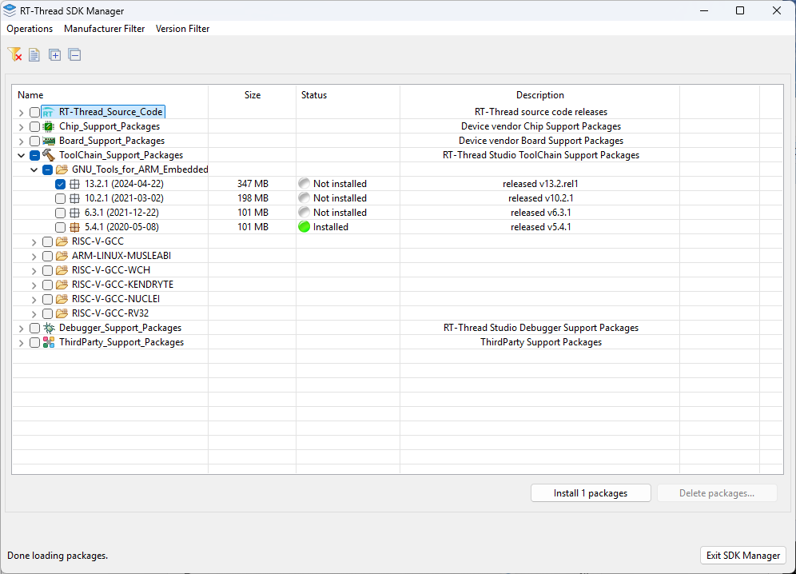

# ติดตั้ง RT-Thread IDE

## ขั้นตอน 1 เปิด browser ไปยัง [https://www.rt-thread.io/](https://www.rt-thread.io/)

- กดไปยัง เมนู Download > Studio เพื่อเข้าสู่ หน้า Download  RT-Thread Studio
  

- link จะเป็น github [https://github.com/RT-Thread/rt-thread](https://github.com/RT-Thread/rt-thread)
- ไปยัง เมนู release ทางด้านขวามือ เพื่อ เข้าไป Download

> [!NOTE]
> ให้ Download `RT-Thread-Studio-setup-x86_64-latest.exe` มายังเครื่อง ของเรา ให้เรียบร้อย  ก่อนที่จะทำการติดตั้งให้ เราสร้าง Folder ชื่อ reneses ที่ drive C: โดย Folder นี้ จะทำหน้าเป็นเสมือน Folder สำหรับ รวมรวม Software ที่จะติดตั้ง Project ของเรา ต่อๆ ทำให้สะดวก คล่องตัวในการพัฒนา

- โครงสร้าง Structure Folder ที่จะใช้  ใน workshop
  

## ขั้นตอน 2 ติดตั้ง โปรแกรม  
**การติดตั้งโปรแกรม:**
- สร้าง folder ``Reneses`` ใน Drive C:

- Double Click  `RT-Thread-Studio-setup-x86_64-latest.exe`

- กด next  

- เลือกยอมรับ ``I Accept Agreement`` และ กด ``Next``  และให้เปลี่ยน จาก D: -> C:\reneses ก่อน แล้วกด ``ok``

- ให้มั่นใจว่าเรา ติดตั้งใน ตำแหน่งทีต้องการ ถ้าเรียบร้อยให้ดำเนินการกด ``Next`` ได้เลย

- กด install ได้เลย รอจดกว่าจะเสร็จสิ้น (2-3 นาที)

- กด Finish เพื่อ ลอง launch Studio ได้เลย เพื่อดูว่า การติดตั้ง ได้สมบูรณ์ หรือไม่  
  
## เปิดโปรแกรม 
- Load program  

- จะพบกับหน้า welcome มี link ไปยัง Resource ต่างๆ ที่ทาง RT-Thread

## ติดตั้ง SDK ด้วย SDK Manager
- ไปที่ยัง shortcut menu ในตำแหน่ง 1 คือ SDK Manager  กด ได้เลย

- RT-Thread SDK manager จะถูกเปิดขึ้นมา เพื่อให้เราสามารถ ติดตั้ง SDK ตามต้องการ โดย สรุป เราจะทำการติดตั้ง โดยสามารถใช้ mouse scroll เลือกเพื่อเลือก SDK ที่ต้องการ โดยเป้าหมายของเรา จะเพิ่มเติมดังนี้
1. เมนู Board_Support_Packages > Renesas > Vision-Board > 1.3.0

2. เมนู ToolChain_Support_Packages > GNU_Tools_for_ARM_Embeded > 13.2.1

3. เมนู Debugger_Support_Packages > PyOCD > 0.2.7 และ 0.2.3  

> [!IMPORTANT]
> ในส่วนของ Menu RT-Thread Source Code จะตรงกับ tag ของ Github ตามรูป แต่ใน workshop เรายังไม่เปลี่ยน version แต่หากท่านใดต้องการทดสอบก็ใช้ RT-Thread SDK manager ติดตั้งได้เช่นกัน
> 
>

clip: 
