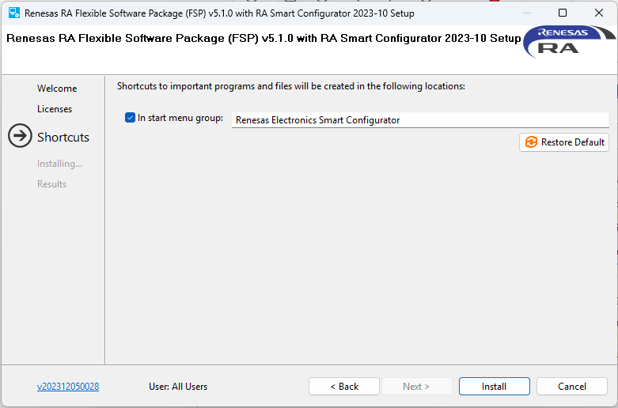

# ติดตั้ง FSP  (Flexible Software Package) v5.1  

**RT-Thread FSP** คือ  อะไร
RT-Thread FSP (Flexible Software Package) คือ ชุดเครื่องมือและไลบรารีที่พัฒนาโดย Renesas ร่วมกับ RT-Thread เพื่อทำให้การพัฒนาแอปพลิเคชันบนไมโครคอนโทรลเลอร์ตระกูล Renesas RA ง่ายและรวดเร็วขึ้น

!!! danger
    ให้ Download และติดตั้ง v5.1 เนื่องจาก จะ Compatible กับ Arm GNU Toolchain 13.2 ที่ใช้ในการทำ Workshop

- FSP เป็นเฟรมเวิร์กสำหรับพัฒนาแอปพลิเคชันบนไมโครคอนโทรลเลอร์ตระกูล RA (ARM Cortex-M)
- Renesas Advanced Smart Configurator - RASC  เป็นเครื่องมือที่มีสร้างที่ตั้งค่า และ สร้างโค้ด (Configuration & Code Generation) 
- Code Generation: สร้างโค้ด C ต้นแบบ (boilerplate code) อัตโนมัติจากการตั้งค่าของคุณ เช่น ฟังก์ชัน hal_entry(), initialization code, interrupt handlers
- Like Release github ``https://github.com/renesas/fsp/releases``
- Like Download version 5.1
- 
[https://github.com/renesas/fsp/releases/download/v5.1.0/setup_fsp_v5_1_0_rasc_v2023-10.exe](https://github.com/renesas/fsp/releases/download/v5.1.0/setup_fsp_v5_1_0_rasc_v2023-10.exe)

แนะนำให้ติดตั้งเครื่องมือเสริมสำหรับการพัฒนา ให้เปิด Browser พี่ที่ Link ด้านบนหลังจากนั้นให้ ทำการ เลื่อนลงมาด้านล่างจนถึงใน Section Asset ดังรูปด้านล่าง และทำการ Download ``setup_fsp_v5_1_0_rasc_v2023-10.exe``
``

!!! Note
    เมื่อ download มาแล้ว ก็ให้ Double Click เพื่อตั้งได้เลย เปลี่ยน path ก่อนนะครับ โดยให้ชี้ไปยัง C:\Reneses เช่นเคย  

  

### เลือก Location  C:\Renesas ในการติดตั้ง

!!! warning
    อย่าลืมเปลี่ยนให้เป็น ``C:\Renesas\RA\sc_v2023-10_fsp_v5.1.0``
  

- ถ้าพร้อมแล้วก็กด Next ได้เลย ยอมรับ Software Agreement และ กด Next
  
  

  

  

- รอประมาณ 2-3 นาที  จนเสร็จเรียบร้อยแล้ว ให้กด ``ok``

