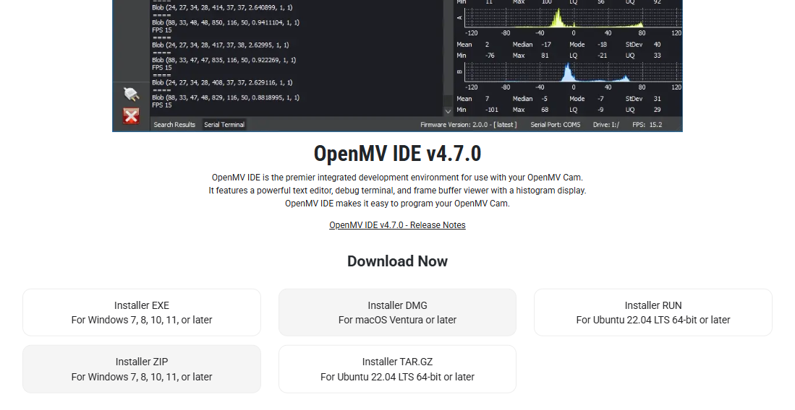
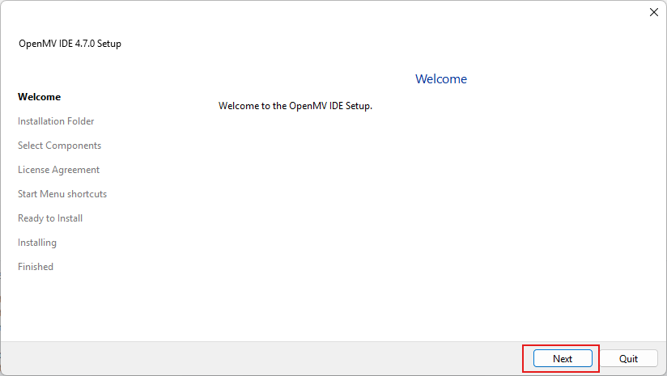
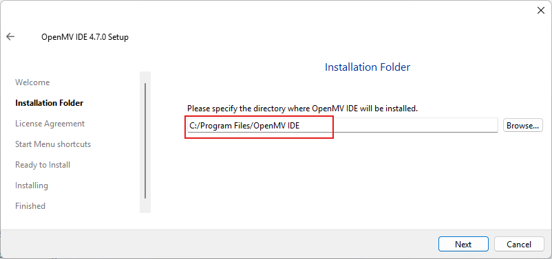
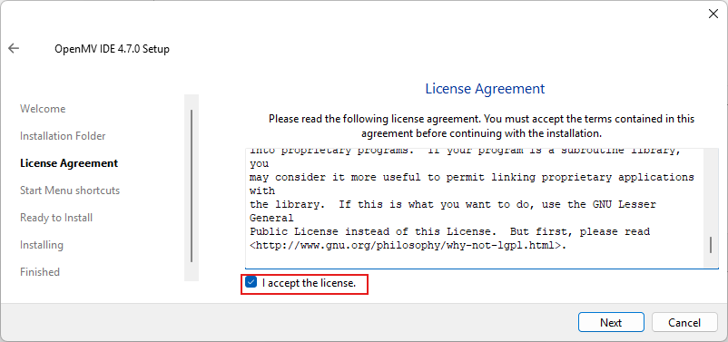
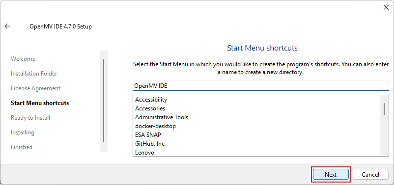
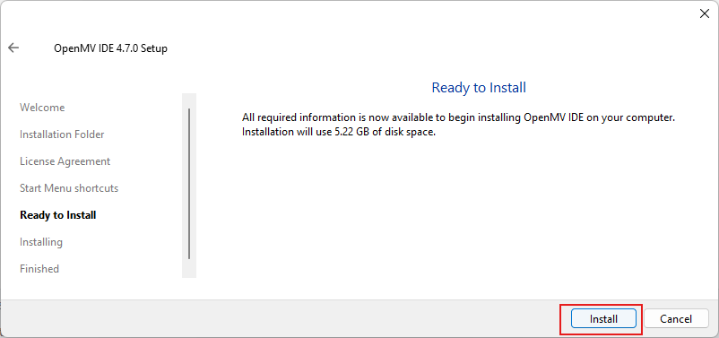
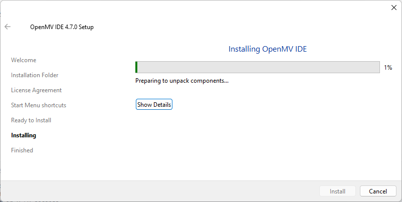
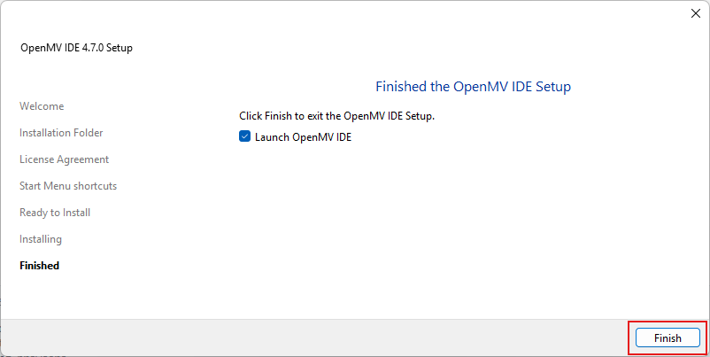
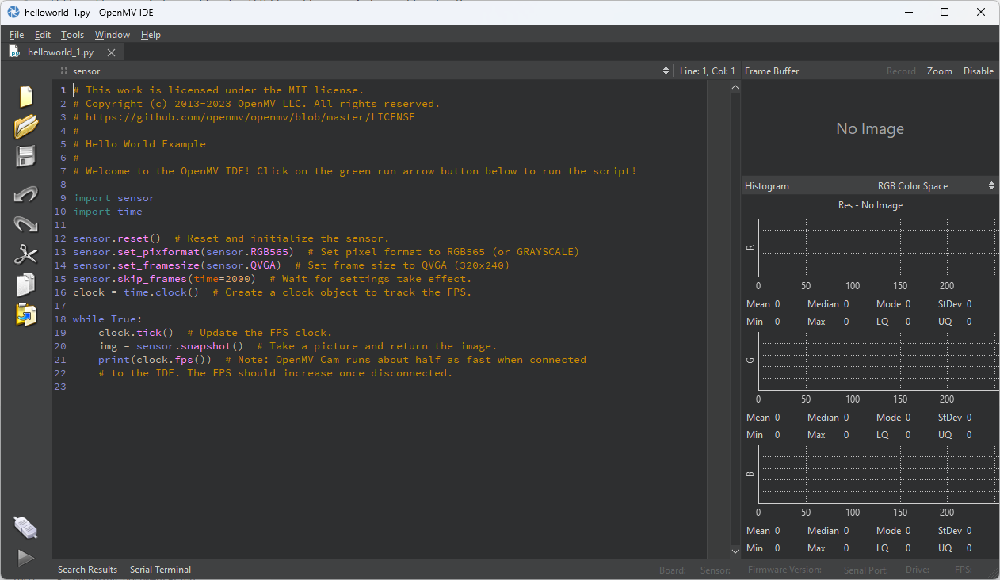

# ติดตั้ง OpenMV v4.7.0

[https://openmv.io/pages/download](https://openmv.io/pages/download)

- ให้ Download openmv เพื่อมาติดตั้ง การติดตั้ง โดยสามารถ Double-Click

- ตำแหน่ง Directory ที่ต้องการติดตั้ง ให้ใช้ชื่อ มาตรฐาน

- ยอมรับ Licence
  
  
- กด install
  
- ให้รอสักครู่
  
- กด Finish
  

## OpenMV IDE Application

  

!!! Note
    OpenMV IDE คือ ซอฟต์แวร์ (โปรแกรม) ที่ใช้สำหรับพัฒนาและโปรแกรมบอร์ด OpenMV Cam ซึ่งเป็นกล้องอัจฉริยะที่ออกแบบมาสำหรับงาน Machine Vision และ IoT โดยใช้ภาษา MicroPython ในการควบคุม 