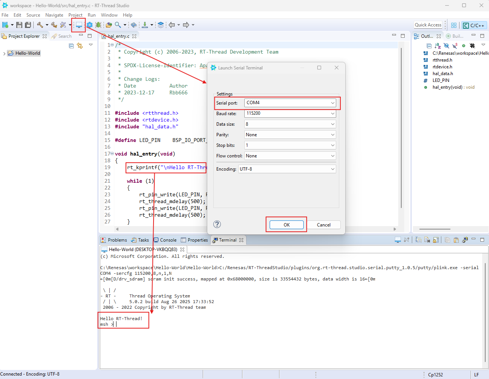

# เริ่มต้นการใช้งาน RT-Thread IDE

!!! note "วัตถุประสงค์"
    - เข้าใจในการใช้เครื่องมือ RT-Thread IDE เพื่อรองรับการพัฒนา 
    - สามารถสร้าง Project ใหม่ ให้ตรงกับ Board ที่ต้องการพัฒนา
    - สามารถ Build โปรเจค และติดตามผลการ Build ได้ทาง Console
    - สามารถ Download โปรแกรมที่ Build เรียบร้อย ลงสู่ Board


- **IDE Structure** องค์ประกอบโครงสร้างของ IDE ที่ควรรู้จัก เพื่อให้เกิดความคุ้นชินในการใช้งาน
  
    - ส่วนที่ 1 เมนู short ที่มีการเรียกใช้
    - ส่วนที่ 2 File หรือ source Code Explorer
    - ส่วนที่ 3 Working Area สำหรับการแสดง Code
    - ส่วนที่ 4 แสดง Output 
    - ส่วนที่ 5 แสดง outine โครงสร้างของ component 
- **ขั้นตอน 1** เตรียมอุปกรณ์ RA8D! Vision Board ให้เรียบร้อย ให้ทำการเชื่อมต่อ USB-DBG ของ VisionBoard เข้ากับ ๊USB ของเครื่องคอมพิวเตอร์  และให้ทำการ เปิด Device Manager ของ Windows เพื่อตรวจสอบการเชื่อมต่อ และ ตรวจสอบดูการ Load ของ Driver 
  
!!! info "USB-DBG"
    USB-DBG ย่อมาจาก USB Debug พอร์ตนี้ทำหน้าที่เป็น อินเทอร์เฟซสำหรับการดีบัก (debug) และการโปรแกรมเฟิร์มแวร์ ลงในไมโครคอนโทรลเลอร์เรเนซัส (RX หรือ RA series) บนบอร์ด Vision

- และให้ทำการกด  Win+X เพื่อเรียกดู Device Manager ตรวจสอบดูให้เรียบร้อยว่าพบ Device ART-Link CMSIS-DAP ดังรูป


- สร้าง folder ชื่อ ``workspace`` ไว้ใน project folder ``C:\Renesas`` ไว้เรียบร้อย


- **ขั้นตอน 2** ตั้งชื่อ Project อะไรก็ได้ จากตัวอย่างตั้งชื่อว่า ``Hello-World``  
    - 2.1 เปิด RT-Thread  Studio เลือก New → RT-Thread Project:
        
    - 2.2 เลือก สร้าง project ชื่อ ``Hello-World`` และเลือกให้เป็น Custom Location , เลือก บอร์ด VISION-BOARD , BSP Version 1.3
        
    - หลังเลือกเรียบร้อย ให้กดปุ่ม Finish
    - 2.3 Rt-Thread สร้าง Project โดยจะสามารถดูได้จาก tab project Explore ทางด้านซ้ายมือ  ต่อจากนั้นก็จะเข้าสู่ กระบวนการ compilation project โดยให้ กดปุ่ม รูปค้อน และ มี popup menu ``Build the activd Configuration of selected projects`` ดังรูป
        
    - 2.4 RT-Thread จะแสดงผลการ Compile ที่หน้าต่างของ Console ด้งรูป
        
        รอสักครู่ จนกระทั้งสิ้นสุด กระบวนการ
        

        !!! Note
            ดุได้จาก Console  หากประสบความสำเร็จก็จะ แสดงผล errors เป็น 0
    - 2.5 ต่อมา เลือกกดปุ่ม รูปเครื่องหมาย Download เพื่อทำการ  เพื่อนำ Code ที่ได้ compile เรียบร้อยแล้ว ไปสู่ Development Board
        
        
        ให้สังเกต หลอดไฟ LED สีฟ้าที่อยู่ด้านหน้าของ Board จะมีการกะพริบ ทุกๆ 500 ms 
        

**ตัวอย่าง Screen**:
    
    - จาก video ด้านบน เราสามารถ ที่จะพัฒนา โปรแกรม และ Build และ upload ได้แบบง่ายๆ 

- **Monitor Code ผ่านทาง Terminal**  
ใน Code ตัวอย่าง มีการใช้คำสั่ง ``rt_kprintf()`` เพื่อ print ค่าออกทาง Terminal ดังนั้น เราต้องทำการเชื่อมต่อไปยัง Terminal เพื่อดูผลของคำสั่ง โดยให้กดปุ่ม รูป Terminal และทำการเลือก Serial port ให้ตรงกับ อุปกรณ์



## เรียนรู้พื้นฐาน การทำงานโปรแกรม

``` C title="hal_entry.c" linenums="1"
/*
 * Copyright (c) 2006-2023, RT-Thread Development Team
 *
 * SPDX-License-Identifier: Apache-2.0
 *
 * Change Logs:
 * Date           Author        Notes
 * 2023-12-17     Rbb666        first version
 */

#include <rtthread.h>
#include <rtdevice.h>
#include "hal_data.h"

#define LED_PIN    BSP_IO_PORT_01_PIN_02 /* Onboard LED pins */

void hal_entry(void)
{
    rt_kprintf("\nHello RT-Thread!\n");

    while (1)
    {
        rt_pin_write(LED_PIN, PIN_HIGH);
        rt_thread_mdelay(500);
        rt_pin_write(LED_PIN, PIN_LOW);
        rt_thread_mdelay(500);
    }
}

```

### สรุป Code ได้ดังนี้

โค้ดนี้เป็นโปรแกรมพื้นฐานสำหรับไมโครคอนโทรลเลอร์เรเนซัส RA series ที่ใช้ RT-Thread OS ทำหน้าที่แสดงข้อความ "Hello World" และกะพริบ LED บนบอร์ด
- ส่วนที่ 1  Header file
```
#include <rtthread.h>      // เฮดเดอร์ไฟล์หลักของ RT-Thread OS
#include <rtdevice.h>      // สำหรับการทำงานกับอุปกรณ์ต่างๆ ใน RT-Thread
#include "hal_data.h"      // เฮดเดอร์ไฟล์ที่สร้างโดย FSP Configurator สำหรับเรเนซัส RA MCU
```

- ส่วนที่ 2 Pin Definition
```
#define LED_PIN BSP_IO_PORT_01_PIN_02 /* Onboard LED pins */
```

- ส่วนที่ 3 Main Function (hal_enntry.c)
```
void hal_entry(void)
{
    // แสดงข้อความทักทายผ่าน serial terminal
    rt_kprintf("\nHello RT-Thread!\n");

    // Infinite loop สำหรับการกะพริบ LED
    while (1)
    {
        rt_pin_write(LED_PIN, PIN_HIGH);  // เปิด LED
        rt_thread_mdelay(500);            // หน่วงเวลา 500 มิลลิวินาที
        rt_pin_write(LED_PIN, PIN_LOW);   // ปิด LED
        rt_thread_mdelay(500);            // หน่วงเวลา 500 มิลลิวินาที
    }
}
```

- Function API หรือ คำสั่งที่ใช้งาน

| Function             | Description                          | Parameters                     |
|----------------------|--------------------------------------|--------------------------------|
| `rt_kprintf()`       | แสดงผลข้อความผ่าน serial console     | สตริงที่ต้องการแสดงผล           |
| `rt_pin_write()`     | ควบคุมสถานะของพินดิจิทัล             | pin_number, PIN_HIGH/PIN_LOW   |
| `rt_thread_mdelay()` | หน่วงเวลาแบบ non-blocking           | เวลาในมิลลิวินาที              |