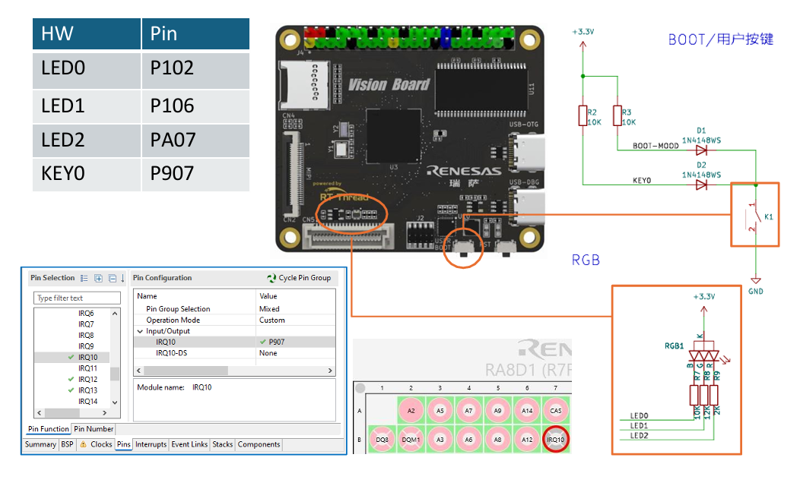
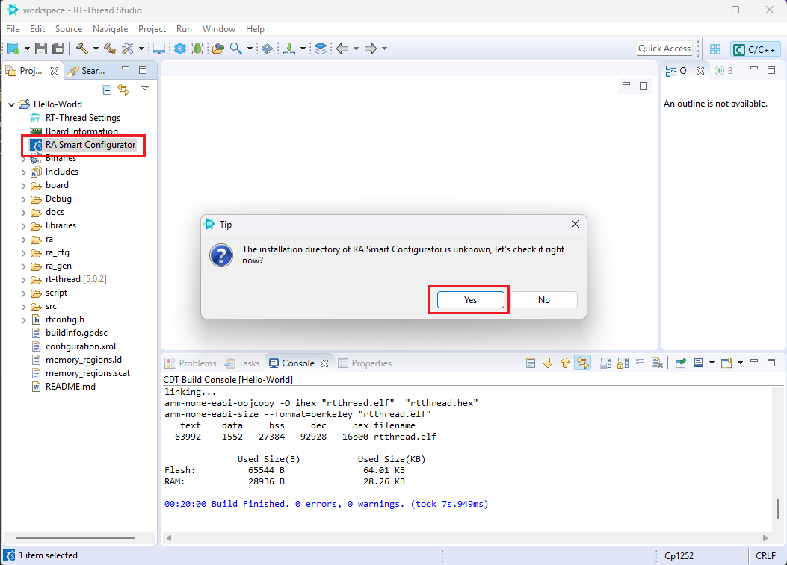
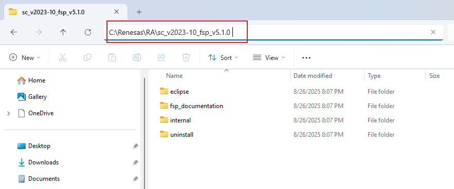
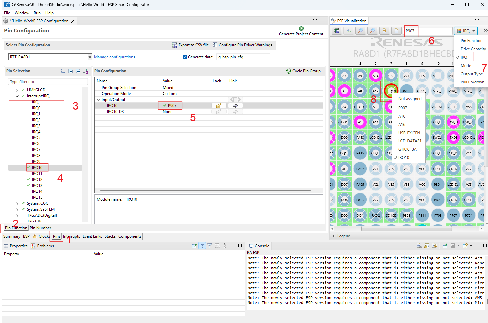
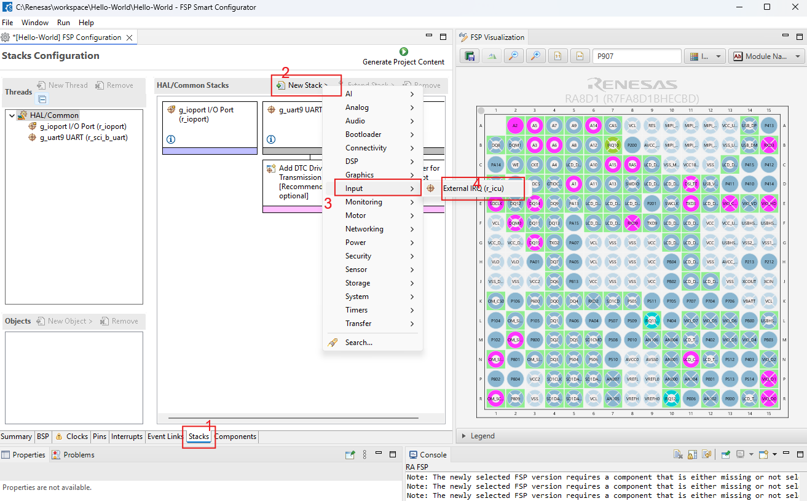
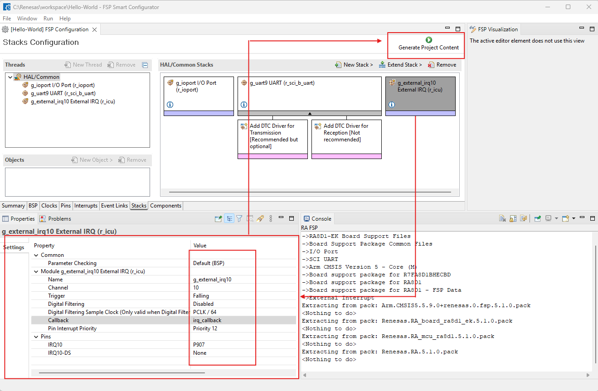
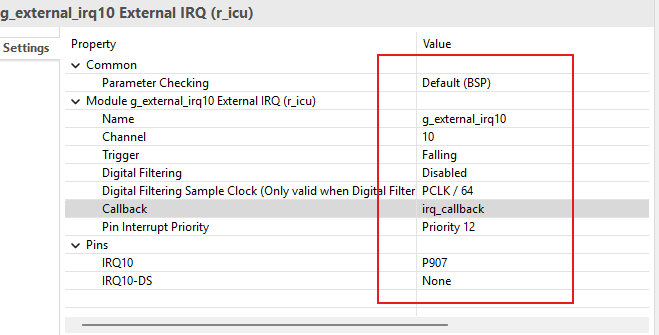
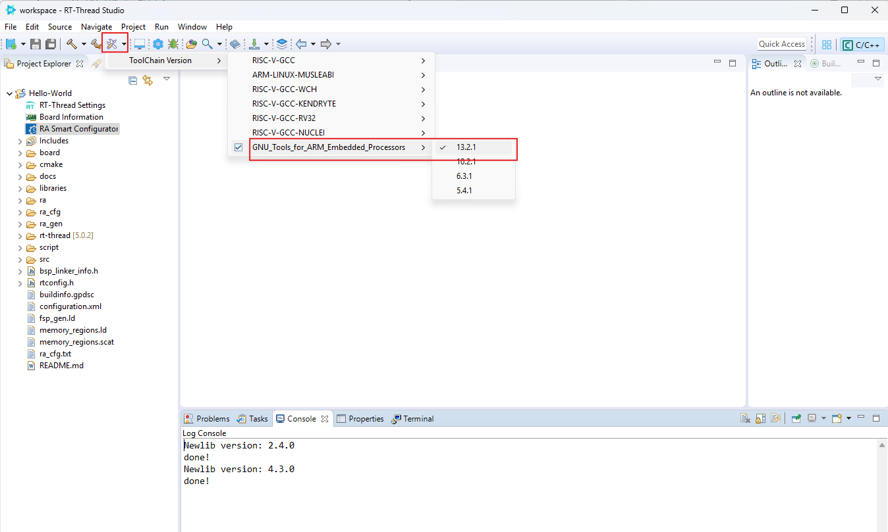
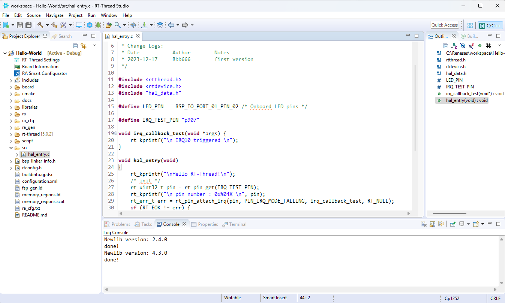
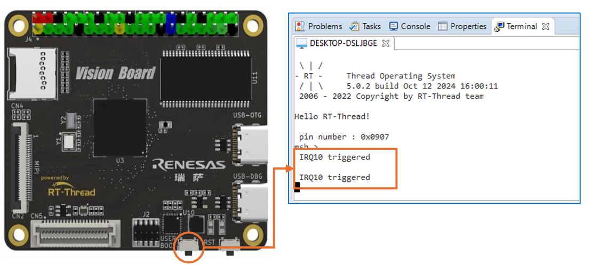

# ทดสอบ GPIO และ การตั้งให้รับการ Interrupt จากภายนอก

!!! note "วัตถุประสงค์"
    - สามารถ สร้าง interupt เมื่อมีการกดปุ่ม K1 



**RT-Thread GPIO** คือ ระบบการจัดการและควบคุมขาพอร์ตอินพุต/เอาต์พุตทั่วไป (General Purpose Input/Output) บนไมโครคอนโทรลเลอร์ (MCU) ซึ่งเป็นส่วนหนึ่งของ ฮาร์ดแวร์ไดรเวอร์ (Hardware Driver) ในระบบปฏิบัติการจริงไทม์ RT-Thread

เป้าหมายหลักคือ ทำให้การควบคุมฮาร์ดแวร์ระดับล่าง (เช่น ตั้งค่าโหมดพิน, อ่านค่า, เขียนค่า) เป็นไปอย่างเป็นมาตรฐานและง่ายขึ้น 

## สิ่งที่ RT-Thread GPIO สามารถตั้งค่าได้:  

- 1 **กำหนดโหมดการทำงานของพิน (Pin Mode):** เช่น ตั้งค่าเป็น Input, Output, Input Pull-up, Input Pull-down, Open-drain เป็นต้น

- 2 **อ่านค่าจากพิน (Read):** อ่านสถานะทางลอจิก (0 หรือ 1) จากพินที่ตั้งค่าเป็นอินพุต

- 3 **เขียนค่าออกสู่พิน (Write):** ตั้งค่าสถานะทางลอจิก (0 หรือ 1) ไปยังพินที่ตั้งค่าเป็นเอาต์พุต

- 4 **จัดการการขัดจังหวะจากพิน (Interrupt):** ตั้งค่าให้พินสามารถสร้างการขัดจังหวะ (Interrupt) เมื่อมีการเปลี่ยนแปลงสถานะ (เช่น เกิดขอบขึ้น - Rising Edge, ขอบลง - Falling Edge) ได้

## Workshop 2 Setup Interupt
- **ขั้นตอน 1** 
    - ตั้งค่าคุณสมบัติของ GPIO ที่ต้องการใช้งาน ในที่นี้ คือการเลือกกำหนดให้แก่ K1 การกำหนดคุณสมบัติจะทำผ่าน โปรแกรม RA Smart Configurator  (จะต้องติดตั้งให้เรียบร้อยก่อน)  โดยให้ Double-Click ที่เมนู RA Smart Configurator เพื่อกำหนดค่าตำแหน่งที่เราติดตั้ง RA Smart Config เอาไว้  
     

    - หลังการนั้นให้เลือก Folder ``C:\Renesas\RA\sc_v2023-10_fsp_v5.1.0``  (คือ ตำแหน่ง folder ที่ติดตั้ง FSP)  
    

    - ให้ทำการเลือก Folder ที่ได้กำหนดในขั้นตอนการติดตั้ง เมื่อทำการเลือก แล้ว จะเข้าสู่ Renesas smart Configurator tools 
        

    - ให้รอสักครู่ จนกระทั้ง มีการแสดงผลดังรูปด้านล่าง
  
- **ขั้นตอน 2** ให้กด เลือกกดตามลำดับดังรูปที่ แสดง ด้านบน  เป็นการ Config pin P907 ให้เชื่อมกับ IRQ10  

!!! Note "ลำดับการเลือกกด"
    เป้าหมายต้องการคือ ใช้ RASC ทำการตั้งค่า pin หมายเลข P907 ให้ทำหน้าเป็น interrupt หมายเลข IRQ10

    - 2.1 กดที่ Tab ``Pins`` ตำแหน่งหมายเลข 1 เพื่อเปิดหน้าต่าง Pin configuration
    - 2.2 เลือก Tab ``Pin Function`` 
    - 2.3 เลือก InterruptIRQ 
    - 2.4 เลือก IRQ10
    - 2.5 เลือกให้ IRQ10 ผูกกับ Pin หมายเลย ``P907``
    - 2.6 ให้ไปยังส่วนของ Tab ด้านขวา คือ FSP Visualization กรอกชื่อ pin  ``P907`` 
    - 2.7 เลือกดู Pin Function เพื่อ verify


---

- **ขั้นตอนที่ 3** สร้าง Newstack 

    !!! Note "ลำดับการเลือกกด"
        - 3.1 กดที่ Tab ``Stacks`` 
        - 3.2 เลือก Tab ``New Stack`` 
        - 3.3 เลือก เมนู ``Input`` -> External IRQ
        - 3.4 เลือก IRQ10
        - 3.5 เลือกให้ IRQ10 ผูกกับ Pin หมายเลย ``P907``
        - 3.6 ให้ไปยังส่วนของ Tab ด้านขวา คือ FSP Visualization กรอกชื่อ pin  ``P907`` 
        - 3.7 เลือกดู Pin Function เพื่อ verify
        - 


    - เมื่อสร้าง Stack เรียบร้อยก็ให้กด ให้ ทำการ Double Click new stack ที่สร้างขึ้นใหม่ จะได้ Windows Proper ด้านล่าง
    - ให้ทำการ Click บรรทัน Trigger เปลี่ยน จาก Rising เป็น Falling
    - หลังจากตั้งเรียบร้อย ก็ให้ปู่ม ชื่อ ``Generate Project Content`` ตามรูปด้านล่าง


- ย้ำให้ตั้งค่าให้ตรงตามนี้ นะครับ



- **ขั้นตอนที่ 4** ฺ Build Project
  - 4.1 เลือก ``Toolchian Versio`` > ``GNU Tools for ARM ...`` > ``13.2.1``
!!! Note
    Location ของ Toolchain
       ``C:\Renesas\RT-ThreadStudio\repo\Extract\ToolChain_Support_Packages\ARM\GNU_Tools_for_ARM_Embedded_Processors\13.2.1``

  - 
  - 4.2 แก้ไข Source code หลัก ``hal_entry.c``  (อยู่ใน ตัวอย่าง /ex_01 folder นะครับ)

``` C title="hal_entry.c for Workshop2" linenums="1"
/*
 * Copyright (c) 2006-2023, RT-Thread Development Team
 *
 * SPDX-License-Identifier: Apache-2.0
 *
 * Change Logs:
 * Date           Author        Notes
 * 2023-12-17     Rbb666        first version
 */

#include <rtthread.h>
#include <rtdevice.h>
#include "hal_data.h"

#define LED_PIN    BSP_IO_PORT_01_PIN_02 /* Onboard LED pins */

#define IRQ_TEST_PIN "p907"

void irq_callback_test(void *args) {
    rt_kprintf("\n IRQ10 triggered \n");
}

void hal_entry(void)
{
    rt_kprintf("\nHello RT-Thread!\n");
    /* init */
    rt_uint32_t pin = rt_pin_get(IRQ_TEST_PIN);
    rt_kprintf("\n pin number : 0x%04X \n", pin);
    rt_err_t err = rt_pin_attach_irq(pin, PIN_IRQ_MODE_FALLING, irq_callback_test, RT_NULL);
    if (RT_EOK != err) {
        rt_kprintf("\n attach irq failed. \n");
    }
    err = rt_pin_irq_enable(pin, PIN_IRQ_ENABLE);
    if (RT_EOK != err) {
        rt_kprintf("\n enable irq failed. \n");
    }

    while (1) {
        rt_pin_write(LED_PIN, PIN_HIGH);
        rt_thread_mdelay(500);
        rt_pin_write(LED_PIN, PIN_LOW);
        rt_thread_mdelay(500);
    }
}
```
  - 4.3 Copy ไปแทนที่ hal_entry.c เดิม ให้เรียบร้อย  
    

  - 4.4 เข้าสู่ขั้น Build Project 
  - 4.5 เชื่อมต่อ USB-DBG ของ Board กับ Computer
  - 4.6 ทำการกดปุ่ม Flash Download เพื่อ โปรแกรม Board
  - 4.7 เปิด Terminal เพื่อเชื่อมต่อกับ Serial Monitor


## ทดสอบ interrup โดยการกด ปุ่ม ตามรูปด้านล่าง


**Screen Test Interrupt**


