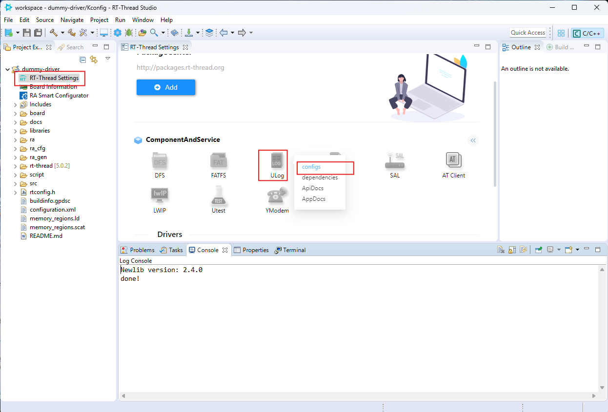
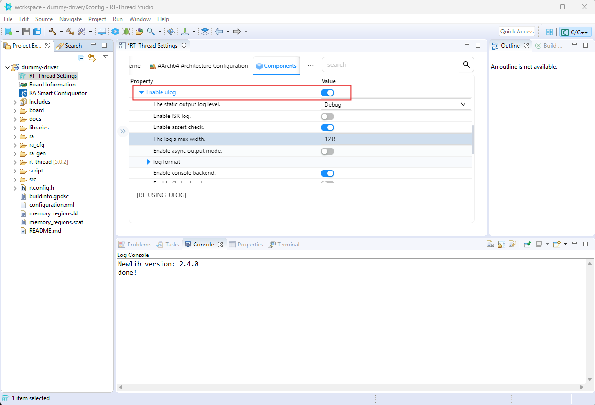
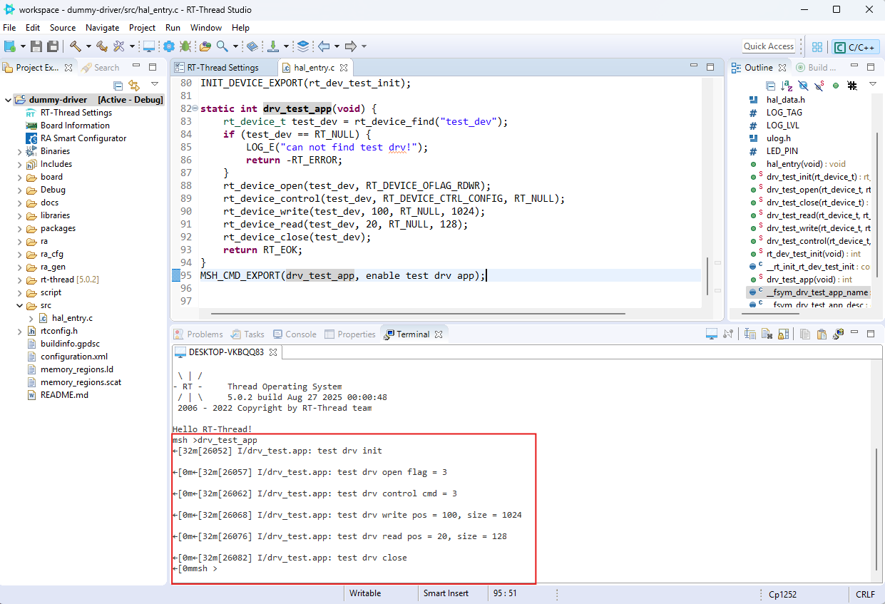

# Dummy Driver

- ขั้นตอน 1 
  - สร้าง Project ใหม่ ให้ชื่อ ว่า ``dummy-driver``
  - กด เลือก RT-Thread Setting  จะเป็นการเปิด config ในส่วน RT-Thread setting
    
  - ในส่วนของ component Service เลือก Ulog icon  และ กด Configs 
    
  - copy code  ``hal_entry.c`` จาก Folder  /ex_02 มาใช้ โดย ทำการ Copy ใส่ไว้ใน ``src``

    ``` C title="hal_entry.c for Workshop3" linenums="1"
    /*
    * Copyright (c) 2006-2023, RT-Thread Development Team
    *
    * SPDX-License-Identifier: Apache-2.0
    *
    * Change Logs:
    * Date           Author        Notes
    * 2023-12-17     Rbb666        first version
    */

    #include <rtthread.h>
    #include <rtdevice.h>
    #include "hal_data.h"

    #define LOG_TAG "drv_test.app"
    #define LOG_LVL LOG_LVL_DBG
    #include <ulog.h>
    #define LED_PIN BSP_IO_PORT_01_PIN_02 /* Onboard LED pins */

    void hal_entry(void) {
        rt_kprintf("\nHello RT-Thread!\n");

        while (1) {
            rt_pin_write(LED_PIN, PIN_HIGH);
            rt_thread_mdelay(500);
            rt_pin_write(LED_PIN, PIN_LOW);
            rt_thread_mdelay(500);
        }
    }

    static rt_err_t drv_test_init(rt_device_t dev) {
        LOG_I("test drv init\n");
        return RT_EOK;
    }

    static rt_err_t drv_test_open(rt_device_t dev, rt_uint16_t oflag) {
        LOG_I("test drv open flag = %d\n", oflag);
        return RT_EOK;
    }

    static rt_err_t drv_test_close(rt_device_t dev) {
        LOG_I("test drv close");
        return RT_EOK;
    }

    static rt_ssize_t drv_test_read(rt_device_t dev, rt_off_t pos, void *buffer, rt_size_t size) {
        LOG_I("test drv read pos = %d, size = %d\n", pos, size);
        return size;
    }

    static rt_ssize_t drv_test_write(rt_device_t dev, rt_off_t pos, const void *buffer, rt_size_t size) {
        LOG_I("test drv write pos = %d, size = %d\n", pos, size);
        return size;
    }

    static rt_err_t drv_test_control(rt_device_t dev, int cmd, void *args) {
        LOG_I("test drv control cmd = %d\n", cmd);
        return RT_EOK;
    }

    static int rt_dev_test_init(void) {
        rt_device_t test_dev = rt_device_create(RT_Device_Class_Char, 0);
        if (!test_dev) {
            LOG_E("test_dev create failed");
            return -RT_ERROR;
        }
        test_dev->init = drv_test_init;
        test_dev->open = drv_test_open;
        test_dev->close = drv_test_close;
        test_dev->read = drv_test_read;
        test_dev->write = drv_test_write;
        test_dev->control = drv_test_control;
        if (rt_device_register(test_dev, "test_dev", RT_DEVICE_FLAG_RDWR) != RT_EOK) {
            LOG_E("test_dev register failed!");
            return -RT_ERROR;
        }

        return RT_EOK;
    }
    INIT_DEVICE_EXPORT(rt_dev_test_init);

    static int drv_test_app(void) {
        rt_device_t test_dev = rt_device_find("test_dev");
        if (test_dev == RT_NULL) {
            LOG_E("can not find test drv!");
            return -RT_ERROR;
        }
        rt_device_open(test_dev, RT_DEVICE_OFLAG_RDWR);
        rt_device_control(test_dev, RT_DEVICE_CTRL_CONFIG, RT_NULL);
        rt_device_write(test_dev, 100, RT_NULL, 1024);
        rt_device_read(test_dev, 20, RT_NULL, 128);
        rt_device_close(test_dev);
        return RT_EOK;
    }
    MSH_CMD_EXPORT(drv_test_app, enable test drv app);


    ```
    - จากนั้น Build Project แนะนำให้ clean ก่อนก็ดี
    - หากไม่มี Error ก็ให้ทำการ Flash Download ไปยัง Board
    - Connect Serial ด้วย Terminal เหมือนเดิม
    - พิมพ์คำสั่งเรียกใช้งาน function ใน msh>
    

## ทดสอบคำสั่งเบื่องต้น
- msh> เป็นเสมือน Shell ของ RT-Thread ที่จะรอรับการสื่อสารจาก user 
- ทดสอบคำสั่ง  ps, help, free
- 
```
msh >ps
rt_thread_ thread       pri  status      sp     stack size max used left tick  error
---------- ------------ ---  ------- ---------- ----------  ------  ---------- ---
0x22007ec8 tshell        20  running 0x000000e4 0x00001000    15%   0x00000007 OK
0x22000664 tidle0        31  ready   0x0000005c 0x00000100    54%   0x0000000e OK
0x22000a90 timer          4  suspend 0x0000007c 0x00000200    24%   0x00000009 OK
0x22007370 main          10  suspend 0x000000cc 0x00000800    15%   0x00000012 EINTRPT
msh >free
memheap       pool size  max used size available size
------------ ---------- ------------- --------------
sdram        33554432   48            33554384
heap         888288     7560          880728

msh >help
RT-Thread shell commands:
drv_test_app     - enable test drv app
clear            - clear the terminal screen
version          - show RT-Thread version information
list             - list objects
help             - RT-Thread shell help.
ps               - List threads in the system.
free             - Show the memory usage in the system.
pin              - pin [option]
reboot           - Reboot System
```


  
