# เรียนรู้ WiFi Experiment ด้วย RW007

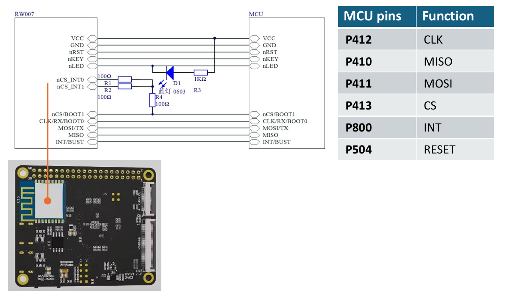

# การเชื่อมต่อ WiFi

## 🖧 MCU Pins และฟังก์ชัน
| MCU Pin | Function |
|---------|----------|
| P412    | CLK      |
| P410    | MISO     |
| P411    | MOSI     |
| P413    | CS       |
| P800    | INT      |
| P504    | RESET    |

---

## 🌍 บทบาทของ Wi-Fi
Wi-Fi มีบทบาทสำคัญพื้นฐานในการผลักดันนวัตกรรมด้าน **IoT** โดยมอบการเชื่อมต่อที่แพร่หลาย เพื่อเชื่อมโยงอุปกรณ์เข้าด้วยกัน เข้าสู่อินเทอร์เน็ต และเชื่อมกับอุปกรณ์ Wi-Fi กว่า **19.5 พันล้านเครื่อง** ทั่วโลก  

- ใช้ทำให้บ้านกลายเป็นบ้านอัจฉริยะ  
- เชื่อมต่ออุปกรณ์ในครัวเรือนที่หลากหลาย  
- ตรวจสอบห่วงโซ่อุปทานและการทำงานที่สำคัญแบบเรียลไทม์ในโรงงานอุตสาหกรรม  
- สร้างคุณค่าทางธุรกิจโดยเพิ่ม **ผลิตภาพ** และ **ประสิทธิภาพ** สำหรับองค์กรและการทำงานแบบ **Hybrid Work**  

---

## ⚙️ โหมดการทำงานของอุปกรณ์ Wi-Fi

### 1. Access Point (AP) Mode
- อุปกรณ์ (เช่น เราเตอร์ไร้สาย) จะสร้างเครือข่ายท้องถิ่นสำหรับอุปกรณ์ Wi-Fi  
- จัดการลูกข่าย, กำหนด IP Address, ควบคุมการเข้าถึงเครือข่ายแบบมีสาย  

### 2. Station Mode (STA) หรือ Client Mode
- อุปกรณ์เชื่อมเข้ากับเครือข่ายที่มีอยู่แล้ว  
- ทำงานคล้ายกับที่สมาร์ทโฟนเชื่อมต่อ Wi-Fi ภายในบ้าน  

---

## 📡 โหมดอื่น ๆ ของ Wi-Fi AP
อุปกรณ์ Wi-Fi AP สามารถทำงานได้หลายโหมด แต่ละโหมดออกแบบมาสำหรับการใช้งานที่ต่างกัน:  

- Local Mode  
- Bridge Mode  
- Client Mode  
- Sniffer Mode  
- Rogue Detector Mode  
- Repeater Mode  

---

## 🔌 โมดูล RW007
- โมดูล **Wi-Fi/BLE ความเร็วสูง** (SPI/UART)  
- พัฒนาโดย **Shanghai Ruiside Electronic Technology Co., Ltd.**  
- ใช้ชิป **Cortex-M4 Wi-Fi SoC**  
- โหมด SPI ต้องใช้:  
  - สัญญาณ SPI 1 ชุด  
  - ขา Interrupt 1 ขา  
  - ขา IO 1 ขา  
- รวมทั้งหมด **8 ขา** (รวมพลังงานและกราวด์)  


## Workshop
- **ขั้นตอนที่ 1 สร้าง Project**
    - สร้าง Project ใหม่ให้ชื่อว่า ``vision_board_wifi`` ด้วยวิธีการเดิม
    - แต่ครั้งนี้เราจะเลือก ชนิดของโปรเจคให้เป็น ``example`` และ เลือกตัวอย่างชื่อว่า ``vision_board_wifi``
    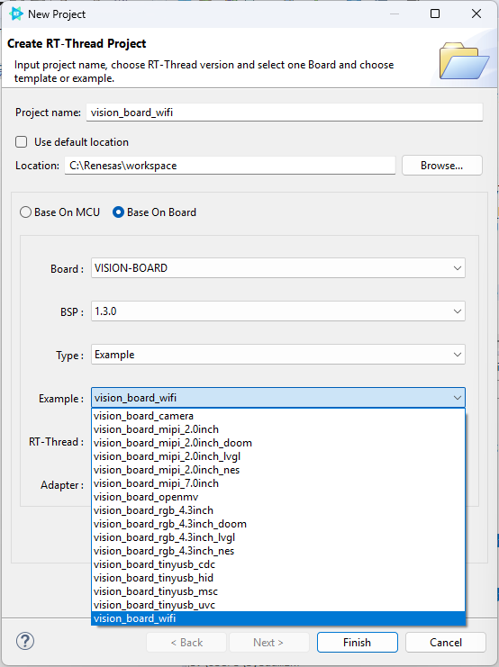

    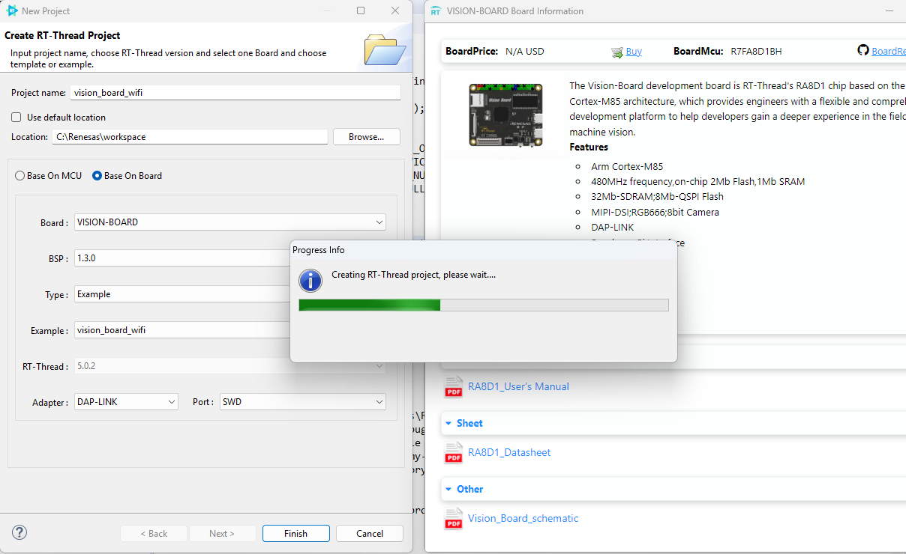

- **ขั้นตอนที่ 2 Enable Module**  
    - คลิกเลือกที่ RT-Thread Settings และ เลือก rw007
    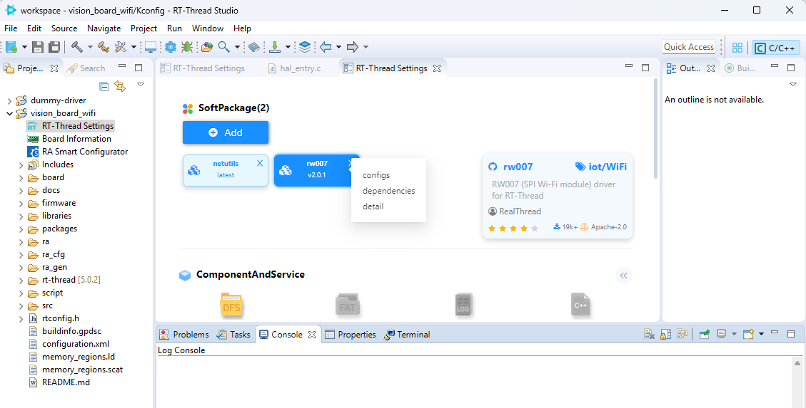

    - rw007 เป็นกลุ่มของ Software package สามารถปรับแต่งได้อย่างยืดหยุ่น เช่น
    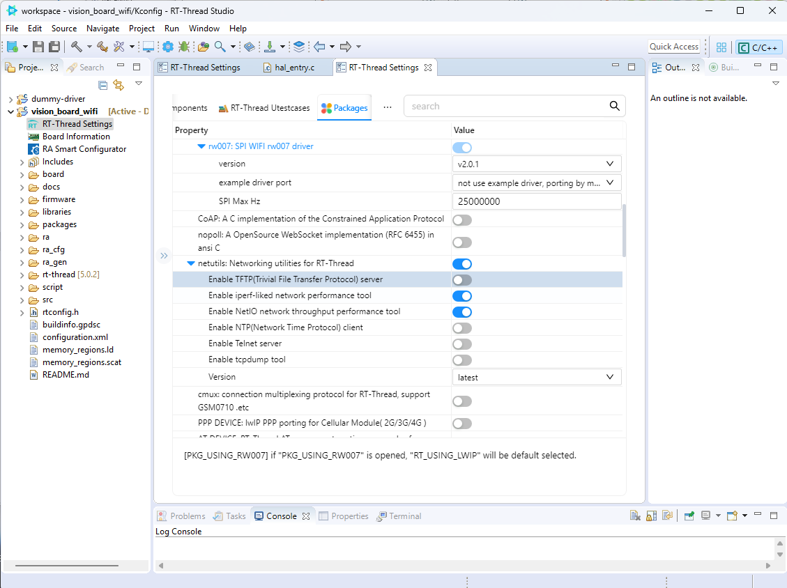

- **ขั้นตอนที่ 3** ตรวจสอบ hardware configuration ผ่านทาง RA Smart Configurator
    - กด เลือก RA Smart Configurator
    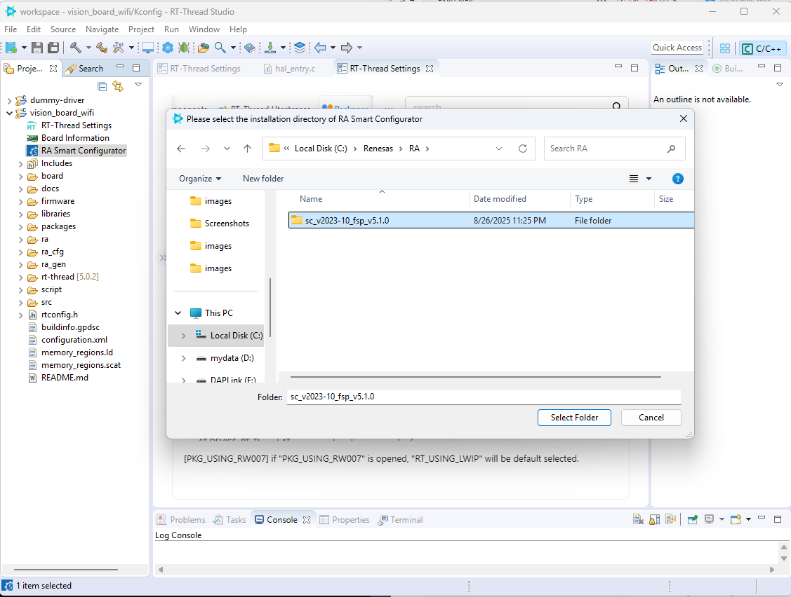

    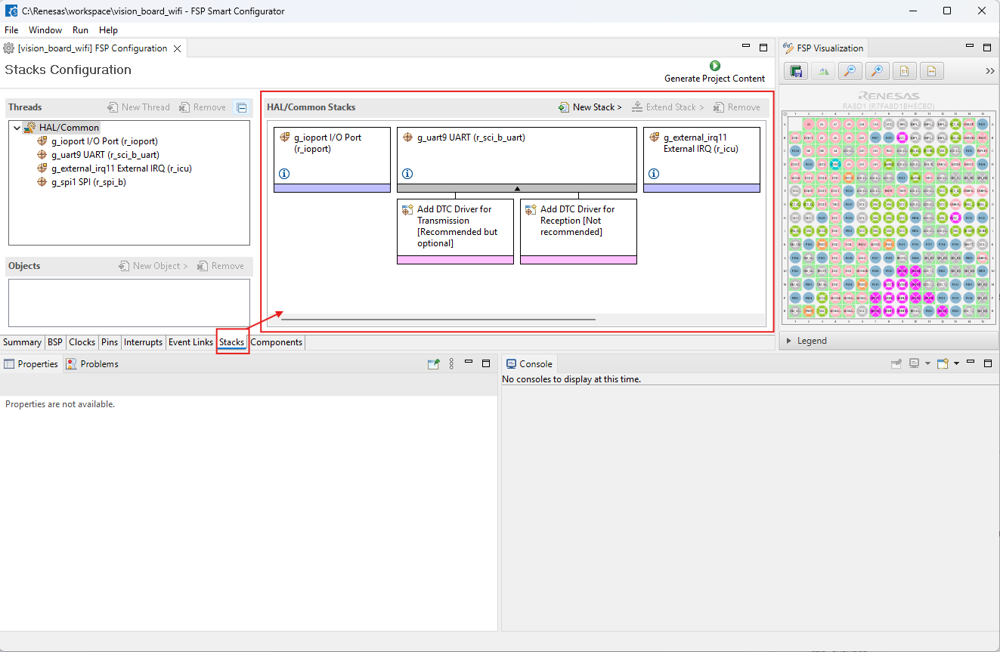

 - **ขั้นตอนที่ 4** 
     - ใช้ ปุ่ม Build Project หรือ เลือกไปยัง Menu Project -> Build All
    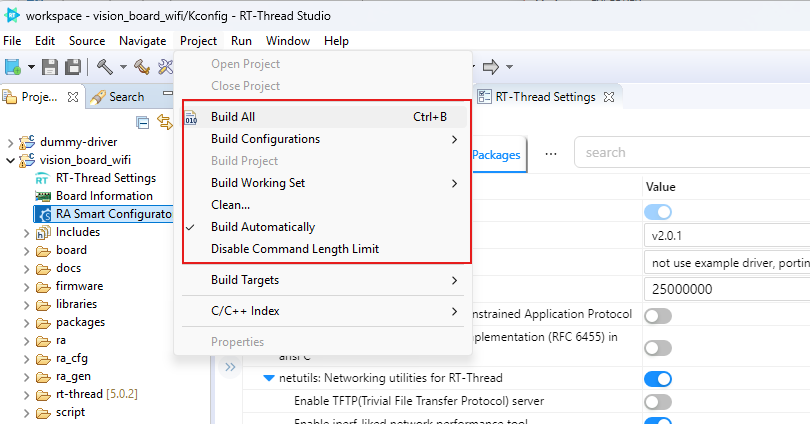

    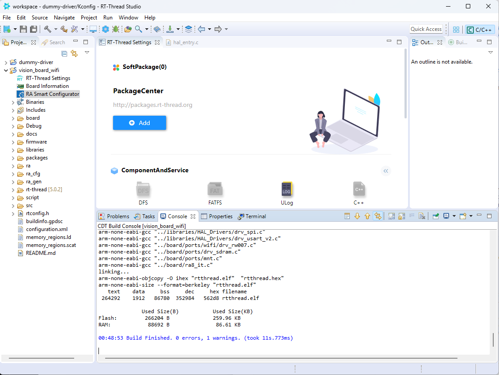

     - ใช้ ปุ่ม Flash Download สำหรับการ Programe ไปยัง Board
    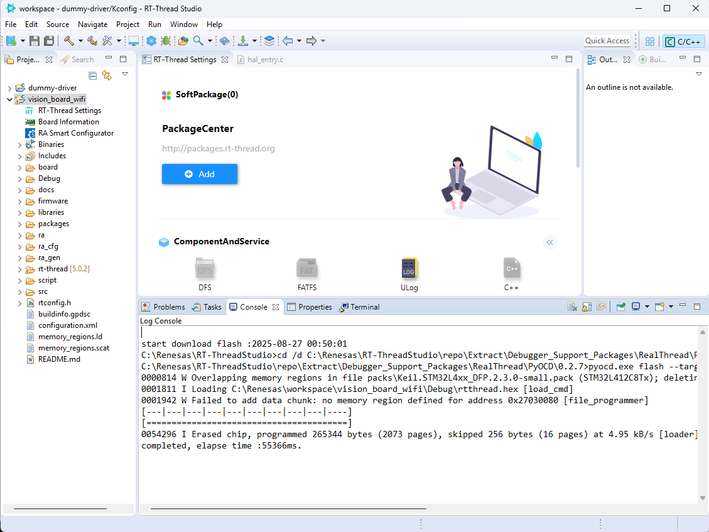

 - **ขั้นตอนที่ 5** 
     - Connect Serial ด้วย terminal
     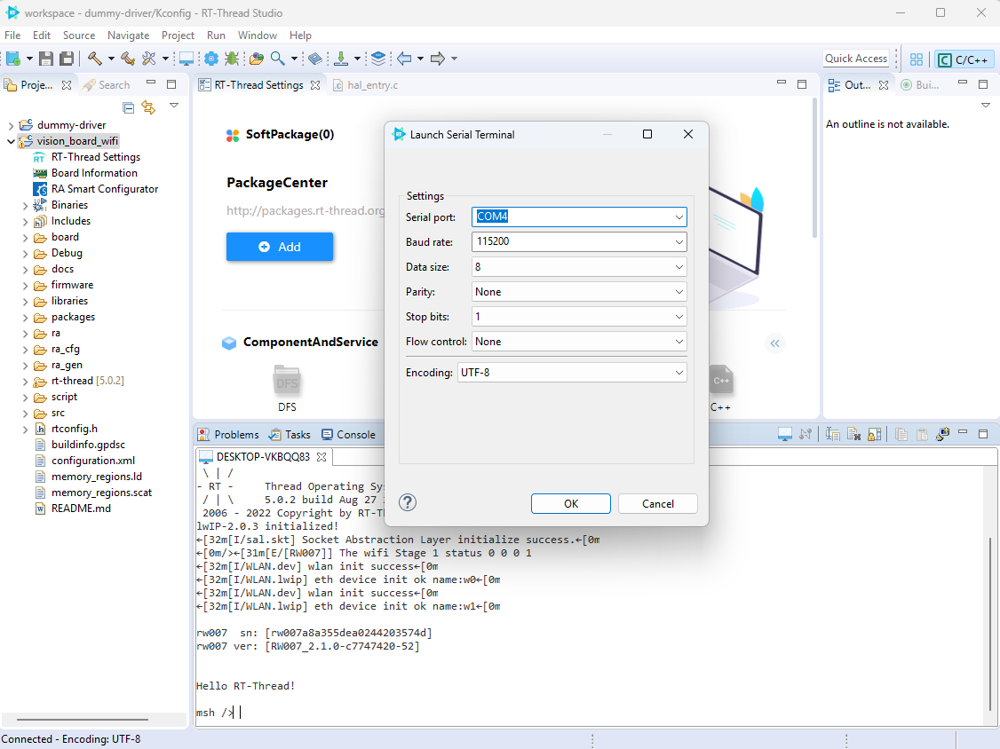

     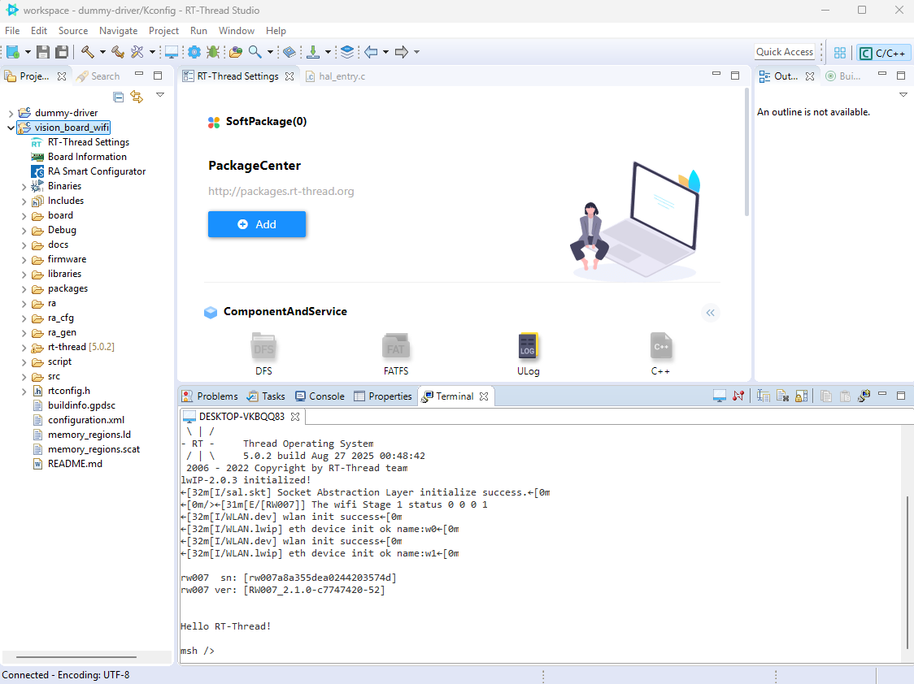

     - ทดสอบคำสั่ง 
```
msh />wifi
wifi
wifi help
wifi scan [SSID]
wifi join [SSID] [PASSWORD]
wifi ap SSID [PASSWORD]
wifi disc
wifi ap_stop
wifi status
wifi smartconfig
msh />wifi scan
             SSID                      MAC            security    rssi chn Mbps
------------------------------- -----------------  -------------- ---- --- ----
roborock-vacuum-s5_miap657D     40:31:3c:a8:65:7d  OPEN           -54    6    0
TrueGigatexFiber_uS7_2.4G       d4:4f:67:11:e9:0c  WPA2_AES_PSK   -58    2    0
```
output:
     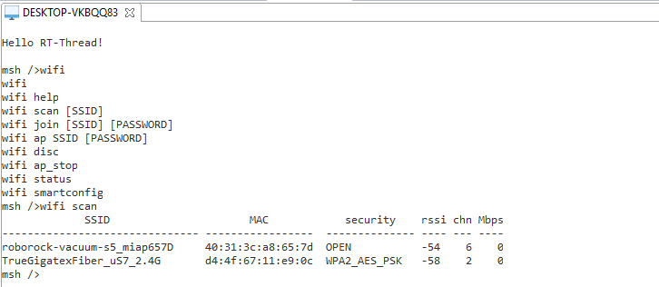

    - **ขั้นตอนที่ 5** ทดสอบการเชื่อมต่อ 
        - คำสั่งที่ ใช้ ``wifi join [ssid] [passward]
        