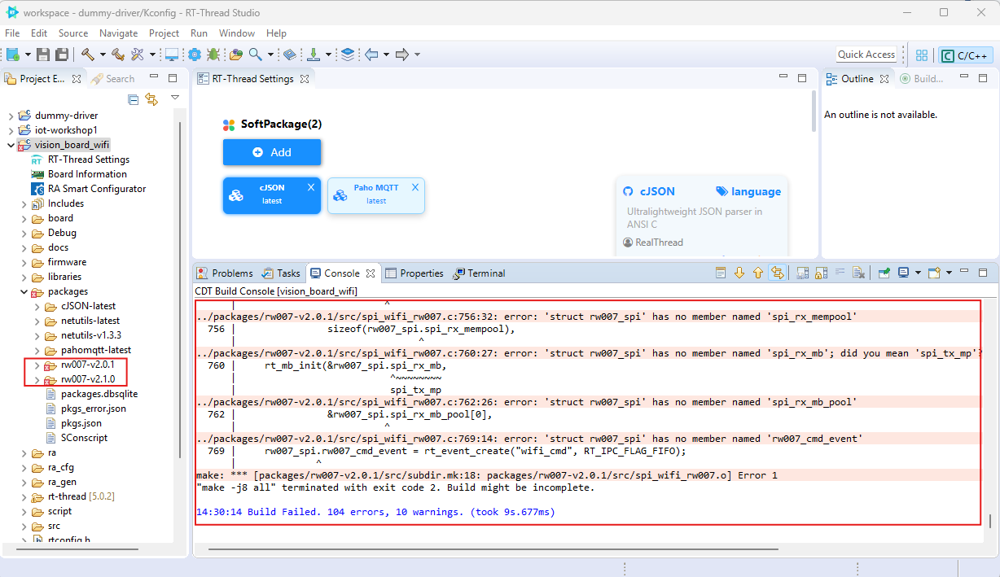

# IoT programing


## อินเทอร์เน็ตของสรรพสิ่ง (Internet of Things - IoT)

**โปรโตคอล IoT** คือชุดของกฎและมาตรฐานที่กำหนดว่าการแลกเปลี่ยนข้อมูลและการทำงานร่วมกันระหว่างอุปกรณ์ในระบบ IoT ควรทำอย่างไร พวกมันกำหนดวิธีการแลกเปลี่ยนข้อมูล รูปแบบของข้อมูล และวิธีการเข้ารหัสและยืนยันตัวตนเพื่อความปลอดภัย  

โปรโตคอล IoT ที่ได้รับความนิยมมากที่สุด ได้แก่ **REST API** และ **MQTT**

---

### REST API
**REST API** หรือ **RESTful API** คืออินเทอร์เฟซที่ช่วยให้ซอฟต์แวร์แอปพลิเคชันต่าง ๆ สามารถสื่อสารกันได้  
- REST (Representational State Transfer) เป็นสถาปัตยกรรมที่ใช้โปรโตคอลการสื่อสารแบบไร้สถานะ (stateless) โดยทั่วไปจะใช้ **HTTP**  
- REST API ทำงานโดยใช้ **HTTP methods มาตรฐาน** ได้แก่:
  - **GET** – ดึงข้อมูล  
  - **POST** – สร้างข้อมูล  
  - **PUT** – แทนที่ข้อมูล  
  - **PATCH** – อัปเดตข้อมูลบางส่วน  
  - **DELETE** – ลบข้อมูล  

วิธีการเหล่านี้ตรงกับการทำงานแบบ **CRUD (Create, Read, Update, Delete)**  

ทุกคำขอ (request) จาก client ไปยัง server เป็นแบบไร้สถานะ (stateless) หมายความว่าในคำขอมีข้อมูลครบถ้วนสำหรับให้ server ดำเนินการได้เอง  
การตอบกลับ (response) จาก server มักมาในรูปแบบของ resource เช่น **HTML, XML, JSON** หรือ **plain text**

---

### MQTT
**MQTT (Message Queuing Telemetry Transport)** เป็นโปรโตคอลการสื่อสารที่ถูกออกแบบมาสำหรับอุปกรณ์ IoT ที่มี **ความหน่วงสูง (high latency)** และ **แบนด์วิดท์ต่ำ**  
- เป็นโปรโตคอลที่ทำงานบน **TCP**  
- ใช้โมเดลการส่งข้อความแบบ **publish/subscribe**  
- เหมาะสำหรับการเชื่อมต่ออุปกรณ์ระยะไกลที่ใช้ **โค้ดขนาดเล็ก** และ **แบนด์วิดท์จำกัด**  

MQTT รองรับการส่งข้อความทั้งจาก **อุปกรณ์ไปยังคลาวด์ (device-to-cloud)** และจาก **คลาวด์ไปยังอุปกรณ์ (cloud-to-device)** ซึ่งทำให้สามารถส่งข้อความไปยังกลุ่มของอุปกรณ์ได้ง่าย  

หัวใจสำคัญของ MQTT คือ **MQTT broker**  
- การสื่อสารทั้งหมดจะต้องผ่าน broker  
- broker จะทำหน้าที่รับข้อความ  
- ตรวจสอบว่าใครเป็นผู้สมัครรับ (subscriber)  
- จากนั้นส่งข้อความไปยัง client ที่เกี่ยวข้อง

## Workshop IoT
- **ขั้นตอน 1**  สร้าง Project "iot-workshop1" อีกครั้ง
  

- **ขั้นตอน 2**  เปิดไปยัง RT-Thread Settings  >  SoftwarePackage  และเลือกทำการติดตั้ง ``pahomqtt`` และ ``cJson`` packages
  

  

    - เลือกค้นหา pahomqtt
  

    - เลือกค้นหา cJon
  

    - กดปิด ที่ tab เพื่อ save แล้ว RT-Thread IDE จะทำการ Download -> Update Project -> Precompire 
  

    - หลังการ update เรียบร้อยให้เปิด Folder package จะเป็นว่ามี Package ที่เราได้เลือกติดตั้ง
  

- **ขั้นตอน 3**  Clear Error   
    ลองกด Compile , Build All ว่ามี Error อะไรบ้าง หากไม่มีก็ทำในส่วนต่อไปได้ อาจมี error ไม่เหมือนกัน จากรูปด้านบน ก็สามารถแก้โดย ลอง ลบ folder rw007-v2.0.1  เอาออก 1 folder  
    

    ลบ rw007-v2.0 ออก  แล้ว  Build all ใหม่  
    

    ลบ netutils ออก  แล้ว build ใหม่
    

    

    หลังการ Build อีกรอบ
    

- **ขั้นตอน 4**  copy code ชื่อ ``hal_entry_02.c`` จาก folder /ex_03 มาแทนที่ ``hal_entry.c``
``` C title="hal_entry_02.c for Workshop3" linenums="1"
    /*
 * Copyright (c) 2006-2023, RT-Thread Development Team
 *
 * SPDX-License-Identifier: Apache-2.0
 *
 * Change Logs:
 * Date           Author        Notes
 * 2023-12-17     Rbb666        first version
 */

#include <rtthread.h>
#include <rtdevice.h>
#include "hal_data.h"

#include <wlan_mgnt.h>
#include <wlan_prot.h>
#include <wlan_cfg.h>

#include <paho_mqtt.h>
#include <cJSON.h>

#define LED_PIN    BSP_IO_PORT_01_PIN_02 /* Onboard LED pins */

#define WIFI_SSID       "<WIFI_SSID>"
#define WIFI_PASSWD     "<WIFI_PASSWD>"

#define MQTT_BROKER     "tcp://broker.emqx.io:1883"
#define MQTT_CLIENT_ID  "<MQTT CLIENT ID>"
#define MQTT_PUB_TOPIC  "<MQTT PUB TOPIC>"
#define MQTT_SUB_TOPIC  "<MQTT SUB TOPIC>"


static MQTTClient   mqttClient;

static bool wifiConnected = false;

void wifi_event_handler(int event, struct rt_wlan_buff *buff, void *parameter) {
    wifiConnected = true;
}

static void mqtt_msg_cb(MQTTClient *client, MessageData *msg_data) {
    char topic_txt[256];
    char payload_txt[256];
    memcpy(topic_txt, msg_data->topicName->lenstring.data, strlen(msg_data->topicName->lenstring.data));
    topic_txt[msg_data->topicName->lenstring.len] = 0;
    memcpy(payload_txt, msg_data->message->payload, strlen((char*)msg_data->message->payload));
    payload_txt[msg_data->message->payloadlen] = 0;
    rt_kprintf("Got msg %s from %s\n", payload_txt, topic_txt);
}

static void mqtt_connect_cb(MQTTClient *client) {
    rt_kprintf("\nMQTT connected\n");
}

static void mqtt_online_cb(MQTTClient *client) {
    rt_kprintf("\nDevice online\n");
    client->isconnected = true;
}

static void mqtt_offline_cb(MQTTClient *client) {
    rt_kprintf("\nDevice offline\n");
}

void hal_entry(void) {
    rt_kprintf("\nHello RT-Thread!\n");

    // WiFi
    rt_wlan_set_mode(RT_WLAN_DEVICE_STA_NAME, RT_WLAN_STATION);
    rt_wlan_register_event_handler(RT_WLAN_EVT_READY, wifi_event_handler, RT_NULL);
    rt_wlan_connect(WIFI_SSID, WIFI_PASSWD);
    rt_kprintf("Waiting WiFi: ");
    while(!wifiConnected) {
        rt_kprintf(".");
        rt_thread_mdelay(500);
    }
    rt_kprintf("\nWiFi connected!\n");

    // MQTT
    mqttClient.uri = MQTT_BROKER;

    MQTTPacket_connectData mqttCfg = MQTTPacket_connectData_initializer;
    mqttCfg.clientID.cstring = MQTT_CLIENT_ID;
    mqttCfg.keepAliveInterval = 30;
    mqttCfg.cleansession = 1;
    mqttCfg.username.cstring = RT_NULL;
    mqttCfg.password.cstring = RT_NULL;
    memcpy(&mqttClient.condata, &mqttCfg, sizeof(mqttCfg));

    mqttClient.buf_size = 128;
    mqttClient.buf = rt_calloc(1, mqttClient.buf_size);
    mqttClient.readbuf_size = 128;
    mqttClient.readbuf = rt_calloc(1, mqttClient.readbuf_size);

    mqttClient.connect_callback = mqtt_connect_cb;
    mqttClient.online_callback = mqtt_online_cb;
    mqttClient.offline_callback = mqtt_offline_cb;
    mqttClient.defaultMessageHandler = mqtt_msg_cb;

    mqttClient.isconnected = false;
    paho_mqtt_start(&mqttClient);
    while(!mqttClient.isconnected) {
        rt_thread_mdelay(500);
    }
    paho_mqtt_subscribe(&mqttClient, QOS1, MQTT_SUB_TOPIC, mqtt_msg_cb);

    while (1) {
        rt_pin_write(LED_PIN, PIN_HIGH);
        rt_thread_mdelay(500);
        rt_pin_write(LED_PIN, PIN_LOW);
        rt_thread_mdelay(500);
        paho_mqtt_publish(&mqttClient, QOS1, MQTT_PUB_TOPIC, "hello");
        rt_kprintf("\nMQTT published\n");
    }
}

```
  

- **ขั้นตอน 5**  ถ้าหากไม่มี Error ก็จะเป็นขั้นตอนการ ใส่ค่า Config
  
!!! info
    หากท่านยังไม่มี Account ของ emqx.io ให้ สามารถไปทำตามที่ ["ตั้งค่า emqx"](./mqwx.md)

```
#define WIFI_SSID       "<WIFI_SSID>"
#define WIFI_PASSWD     "<WIFI_PASSWD>"

#define MQTT_BROKER     "tcp://broker.emqx.io:1883"
#define MQTT_CLIENT_ID  "<MQTT CLIENT ID>"
#define MQTT_PUB_TOPIC  "<MQTT PUB TOPIC>"
#define MQTT_SUB_TOPIC  "<MQTT SUB TOPIC>"

```


    - การเชื่อมต่อจะเชื่อมต่อ ไปยัง Broker ที่ ``tcp://broker.emqx.io:1883``
    - แก้ไขค่าของ  ``<WIFI_SSID>, <WIFI_PASSWD>, <MQTT_CLIENT_ID>, <MQTT_PUB_TOPIC>, และ <MQTT_SUB_TOPIC>``
     
!!! Note
    WiFi ต้องเป็น 2.4G ไม่ใช่ 5G

- **ขั้นตอน 6**  เตรียมพร้อมการทดสอบ  
    - **Build** ให้เรา Build All และ Flash Download 


    - **Terminal** เปิด Terminal สำหรับการเชื่อมต่อ ดูผลลัพท์การเชื่อมต่อ
  

- Diagrame การสื่อสาร


**Screen:**
