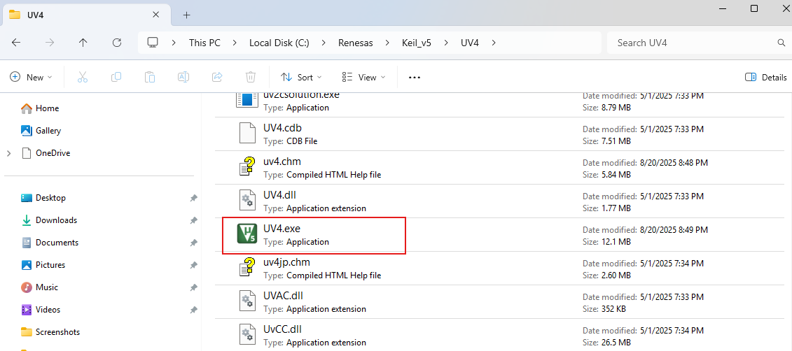

# Workshop OpenMV
- **Ref Source Code ของ OpenMV Board** 
    - ตัวอย่าง OpenMV  Board  [https://github.com/openmv/openmv/tree/master/scripts/examples](https://github.com/openmv/openmv/tree/master/scripts/examples)
    - ตัวอย่าง Vision Board [https://github.com/RT-Thread-Studio/sdk-bsp-ra8d1-vision-board/tree/master/projects/vision_board_openmv/firmware/omv_example](https://github.com/RT-Thread-Studio/sdk-bsp-ra8d1-vision-board/tree/master/projects/vision_board_openmv/firmware/omv_example)
  
  

- เตรียมความพร้อม install Keil µVision
    - ติดตั้ง Keil MDK (Microcontroller Development Kit) คือ ชุดเครื่องมือพัฒนาโปรแกรมสำหรับไมโครคอนโทรลเลอร์ตระกูล ARM [https://www.keil.com/download/product/](https://www.keil.com/download/product/) เลือก MDK-ARM
    - Click MDR-Arm icon ลงทะเบียน ให้เรียบร้อย แล้วจะได้ Link สำหรับการ Download
      

    - Link Download  
      

    - Double click เพื่อทำการ install
    

    - ยอมรับ Licence แล้วกด Next
    

    - เลือก Destination  แทนค่า ``C:\Users\sysadmin\AppData\Local`` ด้วย  ``C:\Renesas`` กด Next  (เน้นอย่าให้ผิดนะครับ)
    - ``C:\Renesas\Keil_v5`` และ ``C:\Renesas\Arm\Packs``
    

    - กรอก Customer info  
    

    - install process  
    

    - ติดตั้ง package 
    

    - ติดตั้ง Driver  
    

    - ติดตั้งเรียบร้อย   
    

    - Package installer  
    
    
## ความสำคัญการติดตั้ง โปรแกรม MDK (Microctroller Development Kit) 
    - คือหลังจากตั้ง MDK จะได้ file UV4.exe ที่ ``C:\Renesas\Keil_v5\UV4\UV4.exe`` ที่เราจะต้องเอาไปใช้ ใน workshop
    
    - ให้เพิ่ม  ``C:\Renesas\Keil_v5\UV4`` ใน Windows Environment ให้เรียบร้อย ด้วยการ พิมพ์ คำว่า env ใน ช่อง Search windows
    - กด ``Environment Variables``  
      

    


## Workshop  OpenMV firmware

- **ขั้นตอน 1 Clone project** 
    - Clone ด้วย Git command ไปที่ C:\Reneses
    ```
    git clone https://github.com/RT-Thread-Studio/sdk-bsp-ra8d1-vision-board.git
    ```
    - File Structure   ``C:\Renesas\sdk-bsp-ra8d1-vision-board\projects\vision_board_openmv``
```
$ tree -L 2
    .
├── Kconfig
├── README.md
├── SConscript
├── SConstruct
├── board
│   ├── Kconfig
│   ├── SConscript
│   ├── board.h
│   ├── ports
│   ├── ra8_it.c
│   └── tinyusb
├── buildinfo.gpdsc
├── configuration.xml
├── docs
│   └── picture
├── firmware
│   ├── omv_example
│   └── openmv.hex
├── memory_regions.ld
├── memory_regions.scat
├── mklinks.bat
├── mklinks.sh
├── packages
│   ├── CmBacktrace-v1.4.1
│   ├── OpenMV-v4.5.0
│   ├── SConscript
│   ├── micropython-v1.13.0
│   ├── rw007-v2.1.0
│   └── tinyusb
├── project.uvoptx
├── project.uvprojx
├── ra
│   ├── SConscript
│   ├── arm
│   ├── board
│   ├── fsp
│   └── tes
├── ra_cfg
│   ├── SConscript
│   └── fsp_cfg
├── ra_gen
│   ├── SConscript
│   ├── bsp_clock_cfg.h
│   ├── common_data.c
│   ├── common_data.h
│   ├── hal_data.c
│   ├── hal_data.h
│   ├── main.c
│   ├── pin_data.c
│   ├── vector_data.c
│   └── vector_data.h
├── rtconfig.h
├── rtconfig.py
├── script
│   ├── ac6
│   ├── fsp.ld
│   ├── fsp.scat
│   └── memory_regions.ld
├── src
│   └── hal_entry.c
├── template.uvoptx
└── template.uvprojx    (<- (MDK project file)>)

25 directories, 38 files
```

    - Click ไปที่ ปุ่ม ``code`` และให้ทำการ Copy link สำหรับนำมาใช้เพื่อการ Clone Source ให้เลือกเป็น Protocol https นะครับ
    

    - เปิด Terminal ของ windows เพื่อทำการ Clone Repository 
    
    หากท่านใดในเครื่องไม่มีคำสั่ง git ให้ทำการติดตั้ง ให้เรียบร้อยก่อน โดยสำหรับ windows ก็ให้ Download ได้ที่ [https://git-scm.com/downloads](https://git-scm.com/downloads)
    

    - เมื่อ Download เรียบร้อย ต่อไปก็จะ ดำเนินการ import เข้าสู่ RT-Thread IDE ซื่งสามารถทได้ โดยไปยัง เมนู File > import และ ชี่ไปยัง Folder ``C:\Renesas\sdk-bsp-ra8d1-vision-board``   
    

    - เลือก RT-Thread Studio Project
    
    
    - เลือก Location ``C:\Renesas\sdk-bsp-ra8d1-vision-board\projects\vision_board_openmv``
    

    - ให้เปิด File Explore แล้วไปยัง project Folder ที่เลือกไว้นะครับ ให้ดูภายใน Folder จะพบว่ามีไฟล์ ชื่อ ``mklinks.bat`` ให้เรา Double Click ไฟล์นี้เพื่อให้ ไปสร้าง Folder ชื่อ libraries และ rt-thread
      

    **Screen**
    

    - ต่อมาให้เราเปลี่ยน Tool Chain เป็น version 13.2.1
    

    - หากมี Error แสดงว่า การเลือก toolchain ผิดพลาด ให้กลับไปเลือกใหม่
    

    - Build All และ Flash Download ไปยัง อุปกรณ์
    
    ไม่มี Error แต่ยังพบ Warning 

    - Flash upload
    

    - Terminal 
    

## เชื่อมต่อ Board ที่ได้ โปรแกรมเรียบร้อย กับ Programe OpenMV

- มีลำดับและขั้นดังต่อไปนี้:  
      - การเชื่อมต่อ ให้สลับช่องเสียบ บนบอร์ด Vision ไปเป็น USB-OTG
      - เมื่อสลับเรียบร้อย ให้เปิด โปรแกรม OpenMV IDE
      - กดปุ่ม Connect เพื่อทำการเชื่อมต่อ โปรแกรม OpenMV IDE กับ Board

    
    
    หากมีความต้องการให้ update firemware เลือก เป็น No ไปก่อน
    

    กดปุ่ม Start เพื่อ ทำการ Run ภาษา Micropython ที่อยู่ใน code editor
    

    กดปุ่ม Terminal เพื่อเปิด Serial Terminal 
    
    ขอแนะนำให้ หารูป ที่มีสีสันชัดเจน เพื่อให้ Sensors สามารถจัด ค่า Spectrum ของสีได้ชัดเจน

    **Screen:**
    

## Workshop  Lab Color Space

- เปลี่ยน โหมด การอ่านภาพ Histograme ให้เป็น ``Lab Color Space``
  

- ต่อไป ให้เลือก Tools > Machine Vision > Threshold Editor และ เลือก ``Frame Buffer as image source``
  

  เลือก เป็น Framebuffer
  

  ปรับค่า L,a,b จนกระทั้งสามารถตรวจวัตถุได้
  

  **Screen:**
  

  - Copy ค่า Lab Threshold เอาไว้ใช้ใน Workshop ต่อไป
  
  ``(18, 78, -69, 39, 29, 32)``

## Workshop ปรับแต่ Micropython code
- ให้เราทำ Workshop ต่อนะครับ ตอนนี้ ก็มาแก้ไข Code ของ Python โดยให้นำค่าที่ Copy เอาไว้ ไปใส่ในค่าตัวแปร ที่ชื่อว่า ``clr_threshold`` โดยเป็นการระบุตัวแปรชนิด tuple 
```
clr_threshold = (18, 78, -69, 39, 29, 32)
```
!!! note
    **LAB Color Space Threshold**   -> (min_L, max_L, min_A, max_A, min_B, max_B)  
    **รายละเอียดค่าใน tuple:**  
        18, 78 → ช่วงค่าความสว่าง (L channel)  
       -69, 39 → ช่วงค่า green-red (A channel)  
       -29, 32 → ช่วงค่า blue-yellow (B channel)  

- สร้าง File > new ชื่อไฟล์ ``object-detection.py``
  
```python   title="helloworld1.py for Workshop6" linenums="1"
# This work is licensed under the MIT license.
# Copyright (c) 2013-2023 OpenMV LLC. All rights reserved.
# https://github.com/openmv/openmv/blob/master/LICENSE
#
# Hello World Example
#
# Welcome to the OpenMV IDE! Click on the green run arrow button below to run the script!

import sensor
import time

clr_threshold =(18, 78, -69, 39, 29, 32)
sensor.reset()  # Reset and initialize the sensor.
sensor.set_pixformat(sensor.RGB565)  # Set pixel format to RGB565 (or GRAYSCALE)
sensor.set_framesize(sensor.QVGA)  # Set frame size to QVGA (320x240)
sensor.skip_frames(time=2000)  # Wait for settings take effect.
clock = time.clock()  # Create a clock object to track the FPS.

while True:
    clock.tick()  # Update the FPS clock.
    img = sensor.snapshot()  # Take a picture and return the image.
    blobs = img.find_blobs([clr_threshold])
    if blobs:
        for b in blobs:
            img.draw_rectangle(b[0:4])
            img.draw_cross(b[5], b[6])
            print(b[5], b[6])
    print(clock.fps())  # Note: OpenMV Cam runs about half as fast when connected
    # to the IDE. The FPS should increase once disconnected.

```
- กดปุ่ม Start อีกครั้ง


**Backup ไฟล์เก่าเก็บไว้สำหรับเอาไว้อ่านค่า Threshold

```python  title="origin.py" linenums="1"
# This work is licensed under the MIT license.
# Copyright (c) 2013-2023 OpenMV LLC. All rights reserved.
# https://github.com/openmv/openmv/blob/master/LICENSE
#
# Hello World Example
#
# Welcome to the OpenMV IDE! Click on the green run arrow button below to run the script!

import sensor
import time


sensor.reset()  # Reset and initialize the sensor.
sensor.set_pixformat(sensor.RGB565)  # Set pixel format to RGB565 (or GRAYSCALE)
sensor.set_framesize(sensor.QVGA)  # Set frame size to QVGA (320x240)
sensor.skip_frames(time=2000)  # Wait for settings take effect.
clock = time.clock()  # Create a clock object to track the FPS.

while True:
    clock.tick()  # Update the FPS clock.
    img = sensor.snapshot()  # Take a picture and return the image.
    print(clock.fps())  # Note: OpenMV Cam runs about half as fast when connected
    # to the IDE. The FPS should increase once disconnected.

```
  