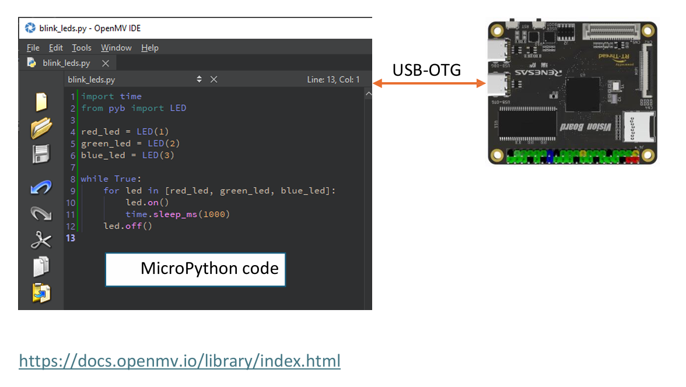
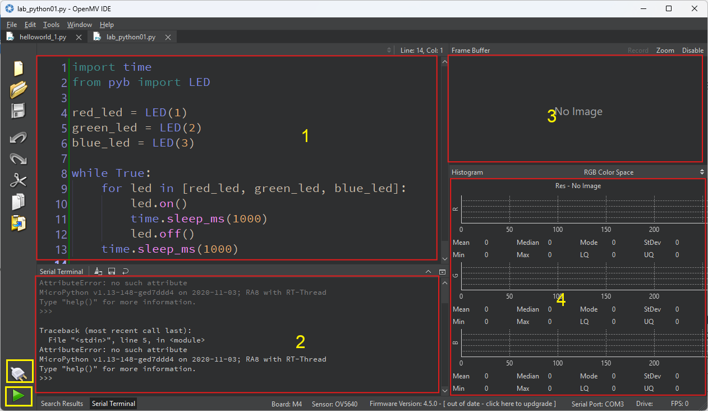
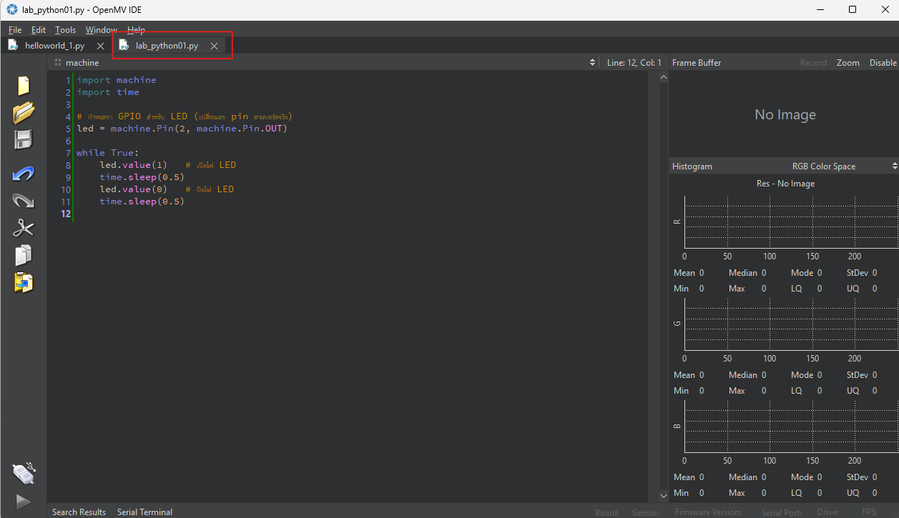

#Micropython Coding



# MicroPython

## ภาพรวม
MicroPython มีโมดูลในตัวที่ออกแบบมาให้คล้ายกับ **Python Standard Library** (เช่น `os`, `time`)  
และยังมีโมดูลเฉพาะของ MicroPython เอง (เช่น `bluetooth`, `machine`)  

- โมดูลจาก Python มาตรฐาน มักมีเพียง **บางฟังก์ชัน** ที่เทียบเท่าใน Python จริง  
- บางโมดูลอาจมี **ฟีเจอร์เพิ่มเติม** ที่เป็นเฉพาะของ MicroPython (เช่น `array`, `os`)  
- เนื่องจากข้อจำกัดของทรัพยากรหรือเวอร์ชันเฟิร์มแวร์ บางพอร์ต/เฟิร์มแวร์ **อาจไม่รองรับฟังก์ชันทั้งหมด**  

---

## Libraries

### ไลบรารีเฉพาะของ **OpenMV Cam**

- **pyb** – ฟังก์ชันที่เกี่ยวข้องกับบอร์ด  
- **cpufreq** – การควบคุมความถี่ของ CPU  
- **sensor** – โมดูลกล้อง (Camera Sensor)  
- **buzzer** – ไดรเวอร์ควบคุมเสียง Buzzer  
- **image** – การประมวลผลภาพ (Machine Vision)  
- **rpc** – ไลบรารีสำหรับ Remote Procedure Call (RPC)  
- **ml** – โมดูล Machine Learning  
- **rtsp** – ไลบรารี RTSP (Real-Time Streaming Protocol)  
- **audio** – โมดูลสำหรับการประมวลผลเสียง  
- **omv** – ข้อมูลของ OpenMV Cam  
- **display** – ไดรเวอร์แสดงผล (Display Driver)  
- **mjpeg** – การบันทึกวิดีโอแบบ MJPEG  
- **imu** – เซ็นเซอร์ IMU (ตรวจจับความเร่ง/ทิศทาง/การหมุน)  

## แนะนำส่วนต่างของ Editor



## ส่วนประกอบหลักของ OpenMV IDE

จากภาพหน้าจอก่อนหน้านี้ พื้นที่สำคัญที่ถูกระบุไว้ ได้แก่:

- **Code Editor** – พื้นที่สำหรับเขียน/แก้ไขโค้ด  
- **Terminal Window** – หน้าต่างเทอร์มินัลสำหรับแสดงผลข้อความ  
- **Image Preview** – หน้าต่างตัวอย่างภาพจากกล้อง  
- **Image Histogram** – กราฟฮิสโตแกรมของภาพ  

---

### ปุ่มที่มุมซ้ายล่างของหน้าจอ
- ปุ่มสำหรับ **เชื่อมต่อกับกล้อง OpenMV**  
- ปุ่มสำหรับ **รันสคริปต์ (Run Script)** ที่เปิดอยู่ใน IDE  

---

### หมายเหตุ
เมื่อเปิด **OpenMV IDE** ขึ้นมาเป็นครั้งแรก  
ระบบจะโหลดสคริปต์ตัวอย่าง **`hello_world.py`** โดยอัตโนมัติ


## Lab 01: Blink LED

- เปิด โปรแกรม OpenMV 
- สร้าง File ใหม่ชื่อ lab_python01.py
  
    

```python title="lab_python01.py for Workshop6" linenums="1"
import time
from pyb import LED

red_led = LED(1)
green_led = LED(2)
blue_led = LED(3)

while True:
    for led in [red_led, green_led, blue_led]:
        led.on()
        time.sleep_ms(1000)
        led.off()
    time.sleep_ms(1000)
```
- กดปุ่ม Connect และ กดปุ่ม Run
- ดูผลลัพท์ ที่ อุปกรณ์ จะเห็นไฟ กระพริบ สีแดง เขียว น้ำเงินสลับกัน

**Screen: Run lab_python01.py**


**Screen: Output lab_python01.py**


## Lab 02: button input

```python title="lab_python02.py for Workshop6" linenums="1"
from machine import Pin
import time

# กำหนดค่าพินของปุ่ม KEY0
PIN_KEY0 = 0x907                # ที่อยู่หรือหมายเลขพินของปุ่ม
key_0 = Pin(("key_0", PIN_KEY0)) # สร้างออบเจ็กต์ Pin สำหรับปุ่ม

# ตัวแปรสถานะปุ่ม
key_flag = 0

# ฟังก์ชัน callback เรียกเมื่อปุ่มถูกกด (Interrupt Handler)
def btn_func(v):
    global key_flag
    key_flag = 1                # เปลี่ยนค่า flag เมื่อมีการกดปุ่ม

# ตั้งค่า interrupt เมื่อเกิด "ขอบขาขึ้น" (RISING EDGE)
# คือเมื่อปุ่มเปลี่ยนจาก '0' เป็น '1'
key_0.irq(trigger=Pin.IRQ_RISING, handler=btn_func)

# วนลูปรอเหตุการณ์
while True:
    if key_flag == 1:           # ตรวจสอบว่ามีการกดปุ่มหรือไม่
        key_flag = 0            # รีเซ็ตค่า flag
        print("user key pressed")  # แสดงข้อความเมื่อกดปุ่ม
```

## Lab 3 การจัดการหน่วยความจำ (Memory Management) และ การสำรวจโมดูลใน MicroPython

```python title="lab_python03.py for Workshop6" linenums="1"
# ตัวอย่างโค้ด MicroPython: การจัดการหน่วยความจำและการสำรวจโมดูล

```python
import micropython 
import gc 

# แสดงฟังก์ชันและคุณสมบัติทั้งหมดที่มีในโมดูล micropython
print(dir(micropython))

# แสดงฟังก์ชันและคุณสมบัติทั้งหมดในโมดูล gc (Garbage Collector)
print(dir(gc))

# แสดงข้อมูลหน่วยความจำ (เปิดโหมดละเอียดด้วย True)
micropython.mem_info(True)

# สั่งให้ Garbage Collector เก็บกวาดหน่วยความจำทันที
gc.collect()

# ตรวจสอบจำนวนหน่วยความจำที่ถูกจัดสรรไปแล้ว (Allocated)
print("Memory Allocated:", gc.mem_alloc())

# ตรวจสอบจำนวนหน่วยความจำที่ยังว่างอยู่ (Free)
print("Memory Free:", gc.mem_free())

# แสดงรายชื่อโมดูลทั้งหมดที่มีให้ใช้งานในปัจจุบัน
help('modules')

```

# คำอธิบาย MicroPython Module และ Garbage Collector

## 1. `import micropython`

- โมดูล `micropython` ใช้สำหรับเข้าถึงฟังก์ชันภายในของ MicroPython
- ใช้ตรวจสอบ/ควบคุมการทำงานระดับล่าง เช่น memory info, การ optimize

---

## 2. `import gc`

- `gc` = Garbage Collector
- ทำหน้าที่จัดการหน่วยความจำอัตโนมัติ (คล้าย Python ปกติ)
- ใน MicroPython อุปกรณ์มี RAM จำกัด จึงควบคุม `gc` สำคัญมาก

---

## 3. `print(dir(micropython))`

- ใช้ `dir()` เพื่อดูรายชื่อฟังก์ชัน/แอตทริบิวต์ทั้งหมดที่อยู่ในโมดูล `micropython`
- ตัวอย่างฟังก์ชันสำคัญ:
  - `micropython.alloc_emergency_exception_buf()` → จัด buffer สำรองสำหรับ exception
  - `micropython.mem_info()` → ดูสถานะ memory

---

## 4. `print(dir(gc))`

- ใช้ `dir()` เพื่อดูฟังก์ชันของ `gc`
- ตัวอย่างฟังก์ชันสำคัญ:
  - `gc.collect()` → เก็บกวาดหน่วยความจำที่ไม่ได้ใช้งาน
  - `gc.mem_alloc()` → ตรวจสอบ RAM ที่ถูกใช้
  - `gc.mem_free()` → ตรวจสอบ RAM ที่เหลืออยู่

---

## 5. `micropython.mem_info(True)`

- แสดงข้อมูลเชิงลึกของหน่วยความจำ
- ถ้าใส่ `True` จะได้รายละเอียดมากขึ้น เช่น การแบ่ง heap, stack

---

## 6. `gc.collect()`

- บังคับให้ Garbage Collector เคลียร์หน่วยความจำที่ไม่ใช้งาน
- มีประโยชน์มากบนบอร์ดที่มี RAM น้อย เพื่อป้องกัน Out-of-Memory

---

## 7. `gc.mem_alloc()` / `gc.mem_free()`

- `gc.mem_alloc()` → จำนวน byte ของ RAM ที่ถูกใช้แล้ว
- `gc.mem_free()` → จำนวน byte ของ RAM ที่ยังว่าง
- ใช้ตรวจสอบว่าโปรแกรมเราใช้ RAM ไปเท่าไร เหมาะกับการ optimize

---

## 8. `help('modules')`

- แสดงรายชื่อโมดูลทั้งหมดที่สามารถ `import` ได้
- ขึ้นอยู่กับว่า firmware/บอร์ดรองรับอะไรบ้าง
- ตัวอย่างโมดูลที่พบบ่อย: `os`, `time`, `machine`, `network`, `bluetooth`, `sensor`, `image` ฯลฯ


## Lab 4 ทดสอบการเชื่อมต่อ Connect wifi

```python title="lab_python04.py for Workshop6" linenums="1"
import network  # โมดูลสำหรับจัดการการเชื่อมต่อเครือข่าย Wi-Fi
import time     # โมดูลสำหรับหน่วงเวลา หรือใช้ฟังก์ชันเวลาต่างๆ

# สร้างวัตถุ WLAN สำหรับโหมด Station (STA) 
# STA = บอร์ดเป็น client เชื่อมต่อกับ Access Point
sta_if = network.WLAN(network.STA_IF) 

# เปิดใช้งาน Wi-Fi
sta_if.active(True)  

# เชื่อมต่อกับ Wi-Fi โดยใส่ SSID และ Password
sta_if.connect("WIFI_SSID", "WIFI_PASSWD")  

# ตรวจสอบว่าเชื่อมต่อสำเร็จหรือยัง (True = เชื่อมต่อแล้ว)
print(sta_if.isconnected())  

# แสดงค่าระดับสัญญาณ Wi-Fi (RSSI) 
print(sta_if.status('rssi'))  

# แสดงค่าการตั้งค่า IP ของบอร์ด (IP, Netmask, Gateway, DNS)
print(sta_if.ifconfig())  
```