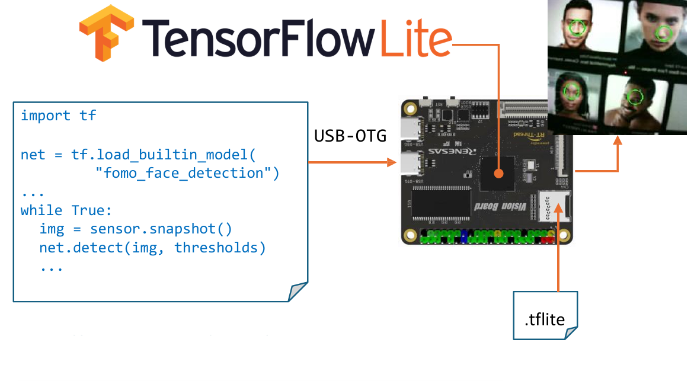
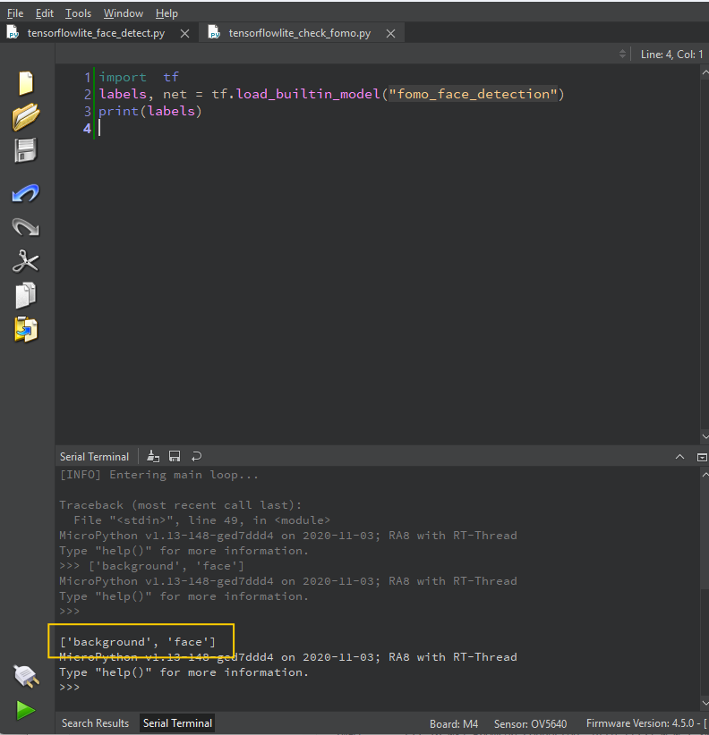
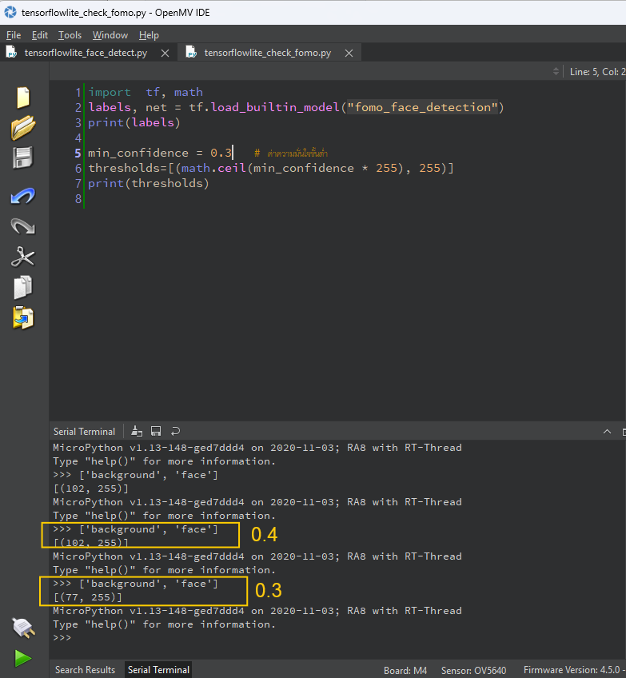
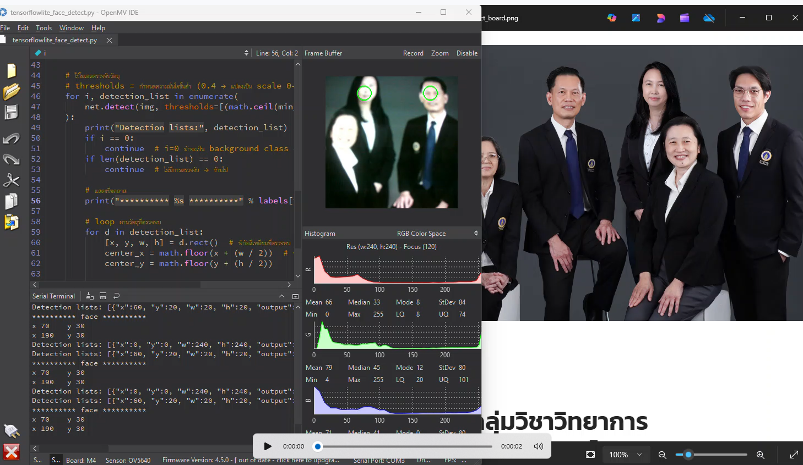

# TensorFlow ร่วมกับ OpenMV



**การเชื่อมต่ออุปกรณ์**  
- ให้เชื่อมต่อกับ port USB-OTG นะครับ
  
!!! note "แหล่งข้อมูลอ้างอิง"
    - [https://docs.openmv.io/library/omv.tf.html](https://docs.openmv.io/library/omv.tf.html)
    - [https://github.com/openmv/openmv/tree/master/scripts/examples](https://github.com/openmv/openmv/tree/master/scripts/examples)


**ตารางสรุป moddole ที่ใช้ใน OpenVM**

| โมดูล      | คำอธิบาย |
|------------|-----------|
| `sensor`   | ใช้ควบคุมกล้อง เช่น `reset()`, `set_pixformat()`, `set_framesize()`, `snapshot()` |
| `image`    | สำหรับจัดการภาพ เช่น `draw_rectangle()`, `draw_string()`, `find_features()` |
| `time`     | ใช้จับเวลา / FPS / delay เช่น `time.clock()`, `time.sleep_ms()` |
| `network`  | ใช้เชื่อมต่อ Wi-Fi ทั้งในโหมด STA (client) หรือ AP (access point) |
| `socket`   | ใช้ทำงาน TCP/UDP communication เช่น HTTP server, WebSocket |


## เรียนรู้ และทำความคุ้นเคยกับโมเดล FOMO Face Detection
ก่อนอื่นเรามาทำความรู้จักและสร้างความคุ้นเคย กับ Fomo Face Detection ของ OpenMV กันก่อนนะครับ คือ 
    - โมเดลตรวจจำวัตถุ มีขนาดเล็กสามารถทำงานได้อย่างรวดเร็ว ที่ทำงานอยู่บน microcontroller ของ OpenMV โดยเราไม่จำเป็นจะต้องทำการ Train Model  ด้วยตัวเอง
    - input ภาพมีขนาด 240x240 RGB
    - output ของโมเดลจะเป็น List ของ กล่องที่ล้อมรอบภาพ (bounding boxes) ที่สามารถตรวจจำได้
    - แยกตาม Class  "background" และ "face"

## Unit Test
### ทดสอบย่อย 1 สำหรับการเรียนรู้
```python   title="tensorflowlite_check_fomo.py" linenums="1"
import tf
labels, net = tf.load_builtin_model("fomo_face_detection")
print(labels)
```


- โมเดล FOMO Face Detection ของ OpenMV จะมี 2 class: ["background", "face"]
- ดังนั้น i=0 คือ background, i=1 คือ face → ใน loop ของคุณมี if i == 0: continue ถูกต้องแล้ว

### ทดสอบย่อย 2 ทดสอบค่าความมั่นใจ
```python   title="tensorflowlite_check_fomo.py" linenums="1"
import  tf, math
labels, net = tf.load_builtin_model("fomo_face_detection")
print(labels)

min_confidence = 0.4   # ค่าความมั่นใจขั้นต่ำ
thresholds=[(math.ceil(min_confidence * 255), 255)]

```
- OpenMV FOMO ใช้ 0–255 scale  
- min_confidence = 0.4 → 102  
- ถ้า threshold สูงเกินไป อาจจะไม่ detect หน้า ให้ลองลดเป็น 0.3 (≈77)  




## Workshop 8 ทดสอบการ Run model
```python   title="tensorflowlite_face_detect.py" linenums="1"
import sensor, time, math, tf

# -----------------------------
# ตั้งค่าเซนเซอร์ของกล้อง OpenMV
# -----------------------------
print("[INFO] Initializing sensor...")  # Debug
sensor.reset()                      # รีเซ็ตเซนเซอร์
sensor.set_vflip(True)              # กลับภาพในแนวตั้ง (ใช้กรณีกล้องกลับหัว)
sensor.set_pixformat(sensor.RGB565) # ตั้งค่าเป็น RGB565 (โหมดสี)
sensor.set_framesize(sensor.QVGA)   # ใช้ความละเอียด QVGA (320x240)
sensor.set_windowing((240, 240))    # ตัดภาพให้เป็นสี่เหลี่ยมจัตุรัส 240x240 (ตรงตาม input ของโมเดล)
print("[INFO] Sensor initialized (240x240 window, RGB565)")
# -----------------------------
# โหลดโมเดลที่มีในเฟิร์มแวร์ OpenMV
# -----------------------------
min_confidence = 0.3   # ค่าความมั่นใจขั้นต่ำ
labels, net = tf.load_builtin_model("fomo_face_detection")
# "fomo_face_detection" เป็นโมเดลตัวอย่าง FOMO ที่ติดมากับ OpenMV IDE
# return: labels = ป้ายชื่อ, net = โมเดล

# -----------------------------
# กำหนดสีที่จะใช้วาด Bounding Box
# -----------------------------
colors = [
    (255, 0, 0),      # แดง
    (0, 255, 0),      # เขียว
    (255, 255, 0),    # เหลือง
    (0, 0, 255),      # น้ำเงิน
    (255, 0, 255),    # ม่วง
    (0, 255, 255),    # ฟ้า
    (255, 255, 255),  # ขาว
]

clock = time.clock()  # ใช้นับ FPS

# -----------------------------
# วนลูปหลัก
# -----------------------------
print("[INFO] Entering main loop...")
while True:
    clock.tick()
    img = sensor.snapshot()  # จับภาพจากกล้อง

    # ใช้โมเดลตรวจจับวัตถุ
    # thresholds = กำหนดความมั่นใจขั้นต่ำ (0.4 → แปลงเป็น scale 0–255)
    for i, detection_list in enumerate(
        net.detect(img, thresholds=[(math.ceil(min_confidence * 255), 255)])
    ):
        print("Detection lists:", detection_list)
        if i == 0:
            continue  # i=0 มักจะเป็น background class → ข้ามไป
        if len(detection_list) == 0:
            continue  # ไม่มีการตรวจจับ → ข้ามไป

        # แสดงชื่อคลาส
        print("********** %s **********" % labels[i])

        # loop ผ่านวัตถุที่ตรวจพบ
        for d in detection_list:
            [x, y, w, h] = d.rect()  # พิกัดสี่เหลี่ยมที่ตรวจพบ
            center_x = math.floor(x + (w / 2))  # หาจุดกึ่งกลาง
            center_y = math.floor(y + (h / 2))

            # แสดงพิกัดใน Serial
            print(f"x {center_x}\ty {center_y}")

            # วาดวงกลมตรงกลางวัตถุ
            img.draw_circle((center_x, center_y, 12),
                            color=colors[i % len(colors)], thickness=2)

```

### Run code

- กดปุ่ม Connect และ Play 
- วิธีการทดสอบ ให้ใช้วธีการเปิด Browser เพื่อทำการค้นหา รูปภาพที่หน้าบุคคล แล้วจึงใช้ กล้องส่องไปยังรูป ดังกล่าว
- การแปลผลให้ดูที่ Terminal ที่มีการแสดงผลออกมา
- หรือท่านสามารถใช้รูปตัวอย่าง 




ใน Workshop ต่อไป จะได้ทำการสร้าง Model ของเราเอง แล้วจึงนำมา Deploy ใน OpenMV