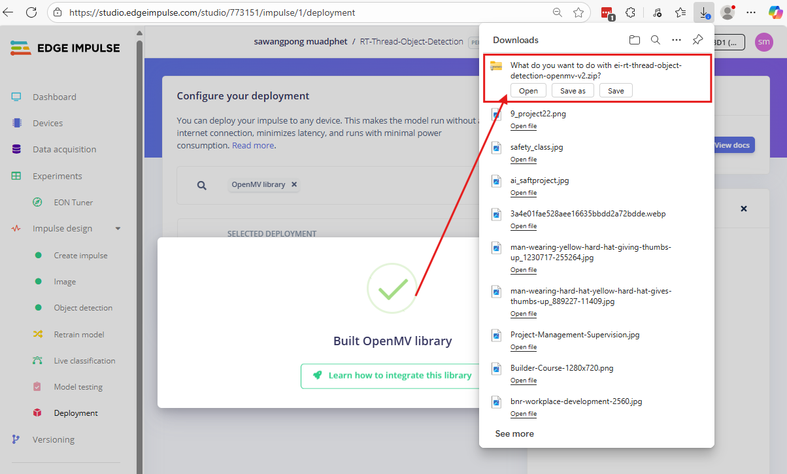
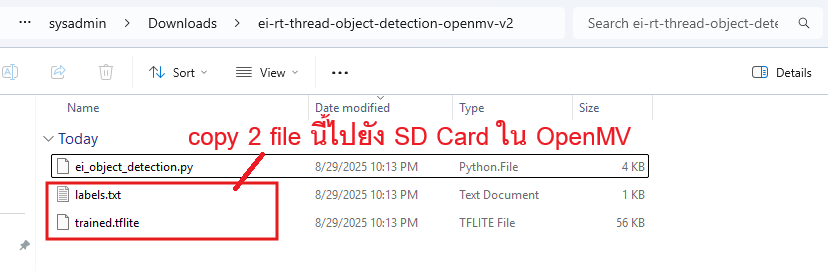

# เรียนรู้ Edge Impulse

## Edge Impulse
Edge AI คือการพัฒนาและปรับใช้อัลกอริทึมปัญญาประดิษฐ์ (AI) และโปรแกรมบนอุปกรณ์ Edge หรืออุปกรณ์ปลายทาง มันเป็นรูปแบบหนึ่งของ Edge Computing ที่ข้อมูลจะถูกวิเคราะห์และประมวลผลใกล้กับจุดที่ข้อมูลถูกสร้างหรือเก็บรวบรวม Edge AI แตกต่างจาก AI บนคลาวด์ ซึ่งข้อมูลจะถูกส่งผ่านอินเทอร์เน็ตไปประมวลผลบนเซิร์ฟเวอร์ระยะไกล

ใน Machine Learning (ML) ข้อมูลจะถูกป้อนเข้าสู่กระบวนการฝึก สำหรับ Supervised Learning จะมีการให้ป้ายกำกับความจริง (ground-truth labels) พร้อมกับแต่ละตัวอย่างด้วย อัลกอริทึมการฝึกจะทำการปรับปรุงพารามิเตอร์ (หรือที่เรียกว่า "น้ำหนัก") ในโมเดล ML โดยอัตโนมัติ

โครงการ ML ส่วนใหญ่จะมีลำดับขั้นตอนคล้ายกันในการ เก็บข้อมูล, ตรวจสอบข้อมูล, ฝึกโมเดล ML และปรับใช้โมเดลนั้น การปรับแต่ง (Optimization) อาจรวมถึงหลายกระบวนการเพื่อลดขนาดและความซับซ้อนของโมเดล ML เช่น การตัดโหนดที่ไม่สำคัญออกจากเครือข่ายประสาท, การทำ Quantization เพื่อให้การทำงานมีประสิทธิภาพมากขึ้นบนฮาร์ดแวร์ราคาประหยัด และการคอมไพล์โมเดลให้รันบนฮาร์ดแวร์เฉพาะทาง (เช่น GPU และ NPU)

Edge Impulse เป็นแพลตฟอร์ม Edge AI ชั้นนำสำหรับการเก็บข้อมูล, ฝึกโมเดล และปรับใช้โมเดลเหล่านั้นไปยังอุปกรณ์ Edge ของคุณ มันให้กรอบงานแบบ End-to-End ที่สามารถเชื่อมต่อเข้ากับ workflow ของ Edge MLOps ของคุณได้อย่างง่ายดาย

## Create account [https://edgeimpulse.com/](https://edgeimpulse.com/)

  

## Create project

- ตั้งขื่อ ``RT-Thread-Object-Detection``

- เลือก Target Device ``Renesas RA8D1 (Cortex-M85 480MHz)``

- เริ่มต้น Project โดยกดปุ่ม ``Add Existing Data`` 

- ถึงตอนนี้เรายังไม่ต้อง upload Data นะครับ 
- แนวทางการเก็บข้อมูล เลือกเมนู ``Data acquisition`` ใน เมนูทางด้านซ้ายมือ สามารถนำเข้าข้อมูลโดยการ upload รูปภาพที่ได้เตรียมไว้ก่อน หรือสามารถเชื่อมต่อกับ โทรศัพท์มือถือ 
  

## โปรเจคตัวอย่าง ``AI-Safety in Workplace``

## วิธีเก็บข้อมูล วิธีที่ 1: เก็บข้อมูลด้วย มือถือ
- **ขั้นที่ 1**
- กด link ``connect to device`` เพื่อเรียก QR code แล้วจึงใช้ โทรมือถือของเรา เชื่อมกับ platform ทำให้เราสามารถใช้ มือถือในการเก็บข้อมูล

- การเก็บข้อมูลโดยใช้มือถือ สามารถจัดเก็บแบบ Realtime ได้

- รูปที่เก็บมาได้ นั้น ยังมีการ Label นะครับ (ทุกรูปก่อนที่นำเข้าสู่กระบวนการ train ต้องมีการ Label เพราะเป็นแบบ Supervise)

- **ขั้นที่ 2** ลากขอบเขต Boundary
  
!!! note
    Labeling หมายถึง การที่ นักวิเคราะห์ข้อมูล Datascience กำหนด Class ให้แก่วัตถุ

- 2.1) คลิกเลือกรูปภาพ ที่ต้องการ label ครับ ก่อนที่จะทำ label เราจะต้องสร้าง Boundary Box คลุม object ในแต่ละรูป ก็เหมือนกับหลายๆ platform ที่เราจะต้องกำหนด position ให้ เนื่องจากเป็นแบบ Supervise นะครับ 

- 2.2) ภายใต้รูปขวามือ ที่เป็น Preview ใต้รูปภาพ จะมีชุดเครืองมีอ Tools  ที่จะใช้  
    

- 2.3) วาดรูปสี่เหลียม เมื่อได้ขนาดที่ต้องการแล้ว ให้ปล่อยมือ
    

- 2.3) กำหนด label จากตัวอย่าง ``safety_hat`` ก็สิ้นสุดกระบวนการ การ Label
    

- 2.4) เลือกรูปใหม่ และเริ่มต้นกระบวนการ 2.1 อีกครั้ง
    

---
- 2.5) เพิ่ม Class อีก Class นะครับ คราวนี้จะเลือกเป็นถุงมือ (Safety_Glove)
    

- 2.6) สามารถเลือกได้มากกว่า 1 object
    
    
--- 

    - 2.7) เพิ่ม Class แว่นตานิรภัย อีก นะครับ

## การแบ่งข้อมูลสำหรับการ Train
Data ที่เรา update ไปจะถูกแบ่งแยก ออกเป็น 2 ส่วนได้แก่ Training Dataset และ Testing Data set ตามรูปด้านล่าง
- Training set สำหรับฝึกโมเดล
- Testing Data set สำหรับทดสอบความแม่นยำ 

---  

## ขั้นตอน Impulse Design

- Input Block → รับข้อมูลดิบ เช่น รูปภาพ  
- Processing Block → แปลงข้อมูลให้อยู่ในรูปที่โมเดลเข้าใจได้ เช่น ย่อขนาด, ทำ normalization  
- Learning Block → ฝึกโมเดล (เช่น Image classification, Object detection)  
- Output Block → ผลลัพธ์สุดท้าย เช่น ระบุว่าเป็น hat / glass /glove หรือกรอบวัตถุในภาพ  

- **Step: Add Process Block**

- กด ปุ่ม ``Add``

- **Step: Add a learning Block**
  

เลือก Object Detection (images)

กด Add 

กด Save Impulse  จบขั้นตอนการสร้าง Pipe Line สำหรับ Traing

---

## ขั้นตอนการสร้าง Generate Feature ของรูปภาพ

แต่ละจุดทาง ซ้ายมือ จะเป็นตัวแทนของ ตัวอย่างของ DataSet

## ขั้นตอน Object Detection
- ขั้นตอนนี้เป็นการปรับแต่ Neural Network Setting

หมายเหตุ จากรูปด้านบน ให้แก้ GPU กลับไปเป็น CPU หาก ขั้นตอนมีการ Error

เข้าสู่ขบวนการ Training ต้องใช้เวลา ในการ Training เมื่อได้ Model ที่ Training เรียบร้อย เราก็จะเอา โมเดลกลับไป Save ใน micro sd card แล้วนำไปใส่ไว้ใน Reneses Vision Board ของเรา

**Error ตอนเลือกให้เป็น GPU** ให้เปลี่ยนกลับมาเป็น GPU

---

## Training เสร็จเรียบร้อย

## เข้าสู่กระบวนการทดสอบ Model Testing
เมื่อทำการ Train เรียบร้อย แล้ว

จะนำ model ที่ได้ ไปทำการ ใปใช้กับข้อมูลที่ได้แยกออกไว้สำหรับการ Test Data

โอ้  Accuracy ได้น้อยเกินไป 

ต่อไปก็จะเป็นการนำโมเดลไปใช้ โดยทาง Edge Impulse สามารถ Optimize ให้เหมาะสมกับอุปกรณ์ที่นำเอาไปใช้

## ขั้นตอน Deployment

เลือก Deployment ค้นหาคำว่า OpenMV library

กดปุ่ม Build ลุยๆๆ ไปเลยครับ

Download model ที่เรากำหนดให้มีการ Deploy สำหรับ OpenMV

### Share File ไว้ให้ใน Google Drive

[https://drive.google.com/file/d/1qCkuNcVtSeblmDeEmcPwPb9ZeelRQ8Ra/view?usp=sharing](https://drive.google.com/file/d/1qCkuNcVtSeblmDeEmcPwPb9ZeelRQ8Ra/view?usp=sharing)

## รับคำแนะนำสำหรับการ integrate library หรือ การนำไปใช้

[https://docs.edgeimpulse.com/tutorials/topics/inference/run-openmv](https://docs.edgeimpulse.com/tutorials/topics/inference/run-openmv)

ถ้าหากไม่ได้ทำเอง ก็ให้ไป Download model จาก Google Drive 

