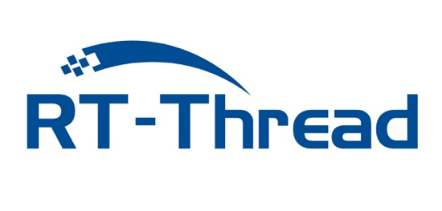

{ .card }

**คณะเทคโนโลยีสารสนเทศและการสื่อสาร** มหาวิทยาลัยมหิดล
(Faculty of Information and Communication Technology, Mahidol University)
{ .card }

#ยินดีต้อนรับทุกท่าน

## :simple-readthedocs:{style="color: orange; font-size: 30px;"} พื้นฐาน RT-Thread
  - [พื้นฐาน RT-Thread Kernel](./01_rt-thread/01.1_rtthread_kernel.md)
  - [พื้นฐาน kernel](./01_rt-thread/01.2_basic_kernel.md)

---

## :fontawesome-solid-list:{style="color: orange; font-size: 30px;"}  การเตรียมการ
  - [ติดตั้ง RT-Thread Ide](./02_Preparation/02.1_install_rt_thread_ide.md)
  - [ติดตั้ง FSP](./02_Preparation/02.2_install_fsp.md)
  - [ติดตั้ง Env Tool](./02_Preparation/02.3_install_env_tool.md)
  - [ติดตั้ง OpenMV](./02_Preparation/02.4_install_OpenMV.md)
  
--- 

{ width="300" }

## :file_folder:{style="color: orange; font-size: 30px;"}   Workshop: RT-Thread 
  - [Workshop1 RT-Thread IDE Basic](./03_workshop1/workshop1.md)
  - [Workshop2 GPIO - Interupt](./04_workshop2/workshop2.md)
  - [Workshop3 Dummy Device](./05_workshop3/workshop3.md)
  - [Workshop4 WiFi RW007](./06_workshop4/workshop4.md)
  - [Workshop5 IoT Programing](./07_workshop5/workshop5.md)
  - [Workshop6 OpenMV](./08_workshop6/workshop6.md)

{ width="300" }

---

## :file_folder:{style="color: orange; font-size: 30px;"}  Workshop:  Micropython บน OpenMV
  - [Workshop7 Micropython](./09_workshop7/workshop7.md)
  - [Workshop8 Face Detection](./10_workshop8/workshop8.md) 
---

## :material-git:{style="color: orange; font-size: 30px;"} Source Code 
  - [https://github.com/thaicodeorg/rt-thread-workshop/tree/main/workshop-code](https://github.com/thaicodeorg/rt-thread-workshop/tree/main/workshop-code)